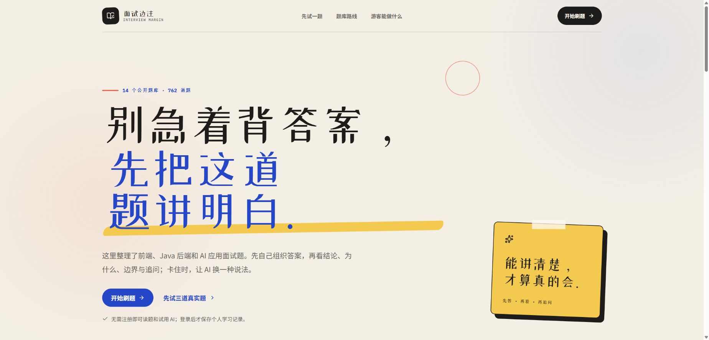
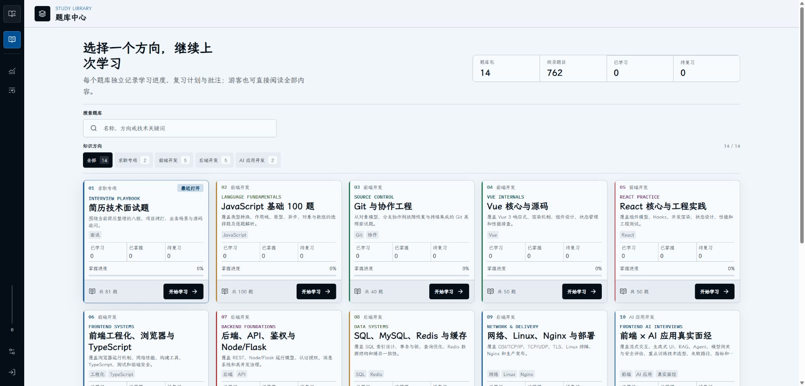
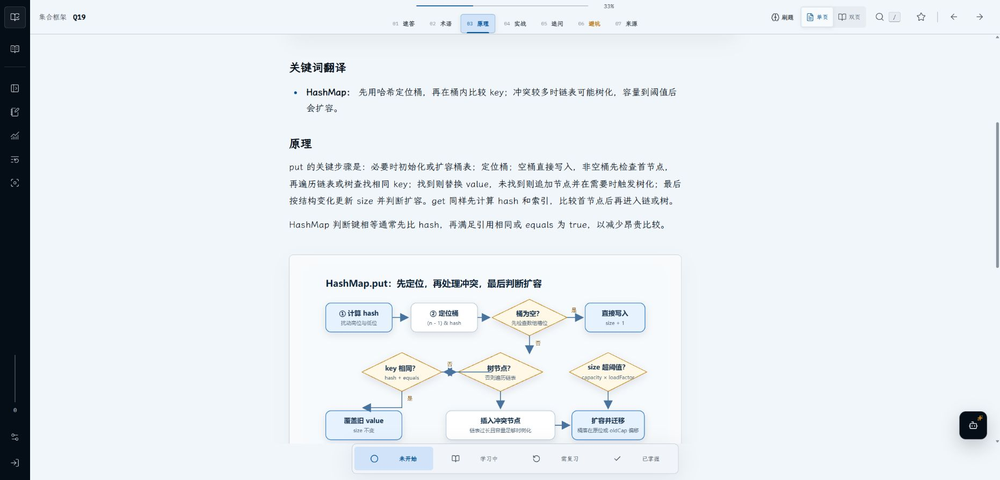
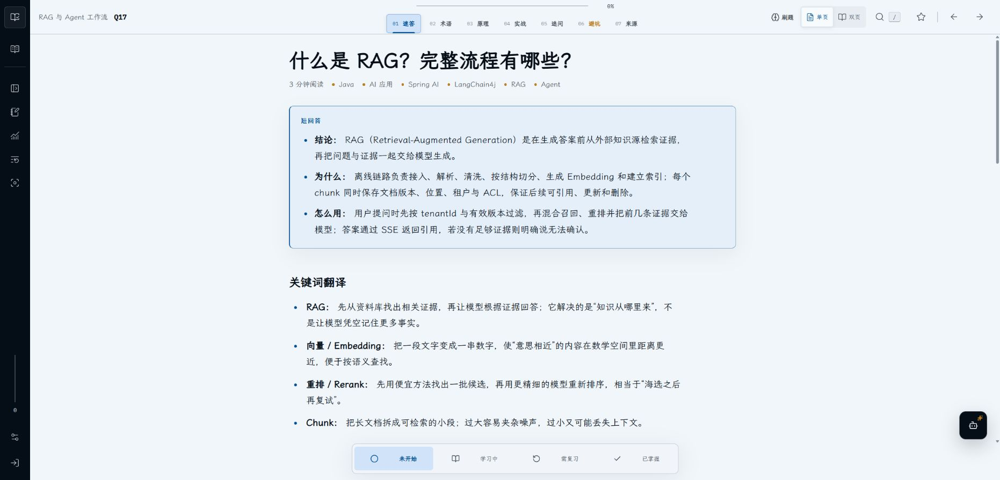
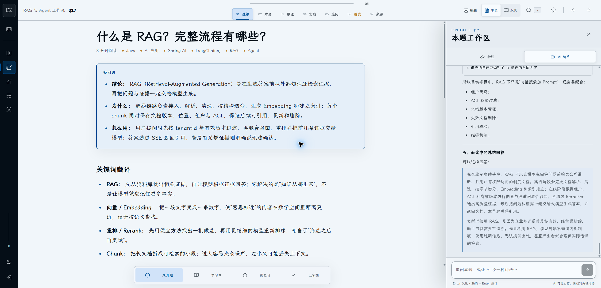
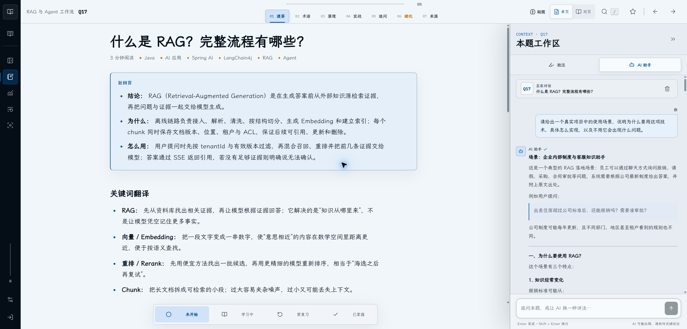
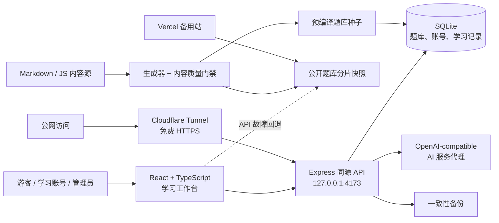

# 面试边注

> 面向求职者与开发者的结构化技术面试学习工作台。

面试边注把高频题库、白话题解、代码与图解、AI 追问、批注和间隔复习放进同一个阅读流程。游客可以直接阅读全部公开内容并体验 AI；登录后再保存个人进度、收藏、批注与复习计划。

`React + TypeScript` · `Express` · `SQLite` · `Vite` · `Cloudflare Tunnel` · `Vercel`

[在线体验](https://interview.linsk27.dpdns.org/) · [直接开始刷题](https://interview.linsk27.dpdns.org/app) · [面试者速览](#面试者速览) · [开发者速览](#开发者速览) · [本地启动](#本地启动)

## 面试者速览

| 你关心的事 | 当前实现 |
| --- | --- |
| 题库规模 | 14 个题库、50 个大章节、762 道公开题；覆盖前端、Java 后端、AI 应用与求职专项 |
| 题解方式 | 每题先给“结论、为什么、怎么用”，再展开原理、代码、图解、追问、易错点与来源 |
| 游客体验 | 无需注册即可阅读、搜索、切题、复制代码、切换版式与字体、使用练习模式和 AI 学习助手 |
| 主动练习 | 先自己回答，再揭晓答案、自评掌握程度，并安排 1 / 3 / 7 天后的复习 |
| 个人记录 | 登录后保存进度、收藏、掌握状态、总结、高亮、批注和复习计划，并跨设备同步 |
| 学习路线 | 前端开发、Java 后端和 AI 应用三条主路线，也可以按题库、章节或关键词自由组合 |

## 产品预览

下面均为正式环境的游客态实机画面，不含账号、批注或后台数据。

<p align="center">
  <a href="docs/assets/readme/01-home.png">
    
  </a>
</p>

<p align="center"><sub>产品首页：先做一道真实题，再进入适合自己的复习路线。点击图片查看原图。</sub></p>

<table>
  <tr>
    <td width="50%" align="center">
      <a href="docs/assets/readme/02-question-bank-hub.png">
        
      </a>
      <br><sub>题库中心：按方向筛选 14 个题库并继续上次学习</sub>
    </td>
    <td width="50%" align="center">
      <a href="docs/assets/readme/03-reader-java-hashmap.png">
        
      </a>
      <br><sub>Java 图解：把 HashMap put 流程拆成可复述的步骤</sub>
    </td>
  </tr>
  <tr>
    <td colspan="2" align="center">
      <a href="docs/assets/readme/04-reader-rag.png">
        
      </a>
      <br><sub>AI 应用：结论、原因、实践与术语翻译分层呈现</sub>
    </td>
  </tr>
  <tr>
    <td width="50%" align="center">
      <a href="docs/assets/readme/05-ai-explanation.png">
        
      </a>
      <br><sub>AI 题解：围绕当前题补充真实场景、实现步骤与面试表达</sub>
    </td>
    <td width="50%" align="center">
      <a href="docs/assets/readme/06-ai-conversation.png">
        
      </a>
      <br><sub>上下文追问：问题与回答始终绑定当前题目，可继续深挖</sub>
    </td>
  </tr>
</table>

### AI 回答为什么能边生成边显示？

可以把这条链路理解成：

`当前题目 + 你的追问 → 同源 AI 代理 → 解析模型的 SSE / NDJSON / JSON → 统一输出 SSE → 前端逐段渲染 Markdown`

- **SSE 是什么：** Server-Sent Events，即服务器通过一条 HTTP 连接持续向浏览器单向发送事件。AI 问答通常是“用户问一次，服务器连续回答”，因此不必为了流式效果额外使用双向 WebSocket。
- **服务端做什么：** 浏览器只请求项目自己的 `/api/ai-chat`；服务端保管密钥、附带当前题目的必要上下文，兼容模型返回的 SSE、NDJSON 或一次性 JSON，再统一向页面发送 SSE 事件。
- **前端做什么：** 使用 UTF-8 解码器和事件缓冲区拼好被网络分片拆开的文字，再增量渲染 Markdown，所以页面会“生成一段、显示一段”，中文和代码块也不会因半个字符或半条事件而损坏。
- **如果模型不支持流式：** 服务端也能读取一次性 JSON，再通过同一条下行链路交给页面；只是首段内容要等完整答案返回，因此“能回答”和“上游能否实时流式输出”不会被绑死。
- **上下文边界：** AI 只获得当前题目和本次对话所需的信息。模型密钥只保存在服务端；浏览器会话仅用于同源鉴权，代理不会把 Cookie、密码或账号资料发送给上游模型。

## 内容与质量

| 指标 | 当前基线 |
| --- | ---: |
| 公开题库 / 章节 / 题目 | 14 / 50 / 762 |
| 首屏包含“结论、为什么、怎么用” | 762 题 |
| 带可核验来源 | 735 题、1,876 条引用、1,136 个唯一 URL |
| 带术语翻译 | 492 题 |
| 带代码示例 | 507 题 |
| 带站内图解 | 48 题 |
| 自动化验证 | 55 个测试文件、399 项测试 |

题目按四个大方向组织：

| 方向 | 题量 | 适合人群 |
| --- | ---: | --- |
| 前端开发 | 300 | JavaScript、Vue、React、工程化、浏览器与 TypeScript |
| 后端开发 | 234 | Java 基础、Spring、数据库、缓存、网络与部署 |
| AI 应用开发 | 75 | RAG、Agent、MCP、Skill、Tool Calling、流式交互与安全 |
| 求职专项 | 153 | 简历项目拷打、真实面经与公司专项准备 |

社区面经只用于确认“真实面试中出现过什么”；答案会重新撰写，并用 Java 官方文档、MDN、框架文档、JavaGuide、小林 Coding 等来源交叉校准。无法公开核验正文的登录墙页面不会伪装成公开证据。

## 开发者速览

| 关注点 | 当前实现 |
| --- | --- |
| Web | React、TypeScript、Vite；题库中心、沉浸阅读器、练习模式、AI 与管理后台按模块拆分 |
| API | Express 同源 API；公开题库、会话、个人学习状态、内容管理、账号、备份、审计和 AI 代理 |
| 数据 | better-sqlite3；WAL、外键和写锁等待；生产数据放在独立持久目录并每日一致性备份 |
| 内容管线 | Markdown / JS 内容源 → 生成与质量门禁 → 分片公开快照 → SQLite 种子；题目 ID 保持稳定 |
| 公开加载 | 首屏只取题库索引，进入题库后按需加载分片；实时 API 失败时回退静态快照和缓存 |
| 身份权限 | `admin / editor / learner` RBAC；Argon2id 密码；HttpOnly + Secure + SameSite=Lax 会话 |
| 学习同步 | 服务端状态为权威；IndexedDB outbox 只保留待确认写入，并按用户隔离防止串号 |
| AI | 浏览器只请求同源服务端代理；兼容流式与一次性响应、首 token 超时、有限重试和备用服务 |
| 部署 | 阿里云 ECS 单 Node 实例、systemd、Cloudflare Tunnel HTTPS；Vercel 保留游客快照与 AI 备用入口 |

## 系统架构



- 正式应用只监听服务器回环地址，公网入口由 Cloudflare Tunnel 提供。
- 生产 SQLite 位于 `/var/lib/interview-margin/data/interview.db`；发布目录通过受控链接访问，不把数据库放进 Git。
- 发布脚本执行构建、测试、内容检查、数据库预检、上线前备份、原子版本切换和健康检查；失败时回滚到上一版本。

## 代码入口

| 路径 | 先从这里理解什么 |
| --- | --- |
| [`src/App.tsx`](src/App.tsx) | 应用路由、题库加载、游客与登录态边界 |
| [`src/components/Reader.tsx`](src/components/Reader.tsx) | 单页 / 双页阅读、练习模式、翻页与阅读状态 |
| [`src/components/QuestionMarkdown.tsx`](src/components/QuestionMarkdown.tsx) | Markdown、代码、表格和受控站内 SVG 图解 |
| [`server/index.js`](server/index.js) | Express 入口、API 与静态资源组合 |
| [`server/database.js`](server/database.js) | SQLite 初始化、迁移、题库种子与持久化边界 |
| [`server/content/`](server/content/) | 题库源、生成器、清晰度增强、来源与质量测试 |
| [`api/ai-chat.js`](api/ai-chat.js) | ECS 与 Vercel 共用的 AI 服务端代理 |
| [`ops/linux/`](ops/linux/) | ECS、systemd、Tunnel、备份、发布和回滚 |

## 本地启动

前置条件：Node.js 22.15 或更高版本。

```powershell
npm ci
Copy-Item .env.example .env
npm run content:export
```

开发时需要两个终端。终端一启动 Express 与 SQLite：

```powershell
npm start
```

终端二启动 Vite；开发服务器会把 `/api` 代理到 `127.0.0.1:4173`：

```powershell
npm run dev
```

生产级验证：

```powershell
npm run build
npm test -- --maxWorkers=1
npm run db:check
```

健康检查：`http://127.0.0.1:4173/api/health`。

## 题库内容开发

不要直接批量修改 `public/question-banks/` 下的生成产物。主要内容源位于：

- `server/content/enrichments/`：JavaScript 与工程题库的逐题原理、示例、追问、易错点和来源。
- `server/content/community-banks/`：Java 基础、Java 后端、Java × AI 与前端 × AI 题库。
- `docs/source/360-ai-frontend/`：360 AI 应用前端专项的脱敏源材料。
- `public/content/diagrams/`：带替代文本的同源 SVG 图解；远程图片、Base64 和危险内联 HTML 会被拒绝。

修改内容源后运行：

```powershell
npm run content:generate
npm test -- --maxWorkers=1
npm run db:check
npm run build
```

`npm run build` 会生成 `catalog-index.json`、`catalog-banks/<id>.json` 和兼容旧客户端的 `catalog.json`。生产启动会严格校验预编译分片；缺失、格式错误或题库 ID 不匹配时拒绝启动。

## 数据、权限与运行边界

| 项目 | 当前边界 |
| --- | --- |
| 游客 | 可阅读全部公开题、搜索、练习并体验 AI；不写个人学习记忆 |
| 学习账号 | 保存个人进度、收藏、总结、批注和复习计划；只能访问自己的状态 |
| 管理员 / 编辑 | 内容 CRUD、归档恢复、Markdown 导入预览、账号邀请、审计与 SQLite 备份 |
| 注册 | 公共注册关闭；普通学习账号使用一次性邀请或由管理员创建 |
| 主站 | [interview.linsk27.dpdns.org](https://interview.linsk27.dpdns.org/)；ECS + Express + SQLite |
| 备用站 | [interview-margin.vercel.app](https://interview-margin.vercel.app/)；公开题库快照与受限 AI 代理 |
| 密钥 | 只保存在服务器或部署平台的环境变量中，不进入浏览器、Git、截图或日志 |

## 技术文档

| 需要了解 | 文档 |
| --- | --- |
| Linux 正式部署、发布与回滚 | [`ops/linux/README.md`](ops/linux/README.md) |
| 社区面经来源审计 | [`docs/COMMUNITY_INTERVIEW_SOURCE_AUDIT.md`](docs/COMMUNITY_INTERVIEW_SOURCE_AUDIT.md) |
| Java 题库全量重建说明 | [`docs/JAVA_INTERVIEW_REBUILD_V2.md`](docs/JAVA_INTERVIEW_REBUILD_V2.md) |
| 产品与交互设计说明 | [`docs/PRODUCT_UI_REDESIGN_BRIEF.md`](docs/PRODUCT_UI_REDESIGN_BRIEF.md) |
| 架构图数据与可视化 | [`docs/diagrams/`](docs/diagrams/) |

如果你只是准备面试，从[在线题库](https://interview.linsk27.dpdns.org/app)开始即可；如果你要继续开发，建议依次阅读“开发者速览 → 系统架构 → 代码入口 → 本地启动”。
