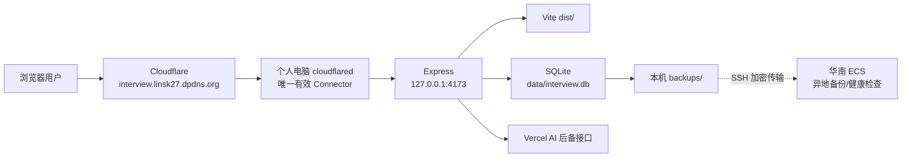

# 个人电脑生产部署与华南 ECS 使用说明

> 更新日期：2026-07-18<br>
> 项目：面试边注（Interview Margin）<br>
> 正式入口：`https://interview.linsk27.dpdns.org`<br>
> 当前推荐方案：个人电脑运行 Express + SQLite，Cloudflare Tunnel 对外提供访问

本文档用于把生产服务从公司电脑迁移到个人电脑，并说明在暂时不方便办理 ICP 备案时，已经购买的中国大陆华南 ECS 应该如何使用。文档中的用户名、路径、Tunnel UUID、IP 和密码都是占位符，执行时必须替换为个人电脑的实际值。

## 1. 先看结论

现阶段采用下面的结构：

- **个人电脑是唯一生产源站**：运行 Node.js、Express 和 SQLite。
- **继续使用现有域名**：`interview.linsk27.dpdns.org`。
- **继续使用现有 Cloudflare named tunnel**：不改博客根域名，不重新建立重复的公开入口。
- **华南大陆 ECS 暂不承载公开 Web 服务**：不把当前域名解析到 ECS，不开放 Nginx 的 80/443 对外提供网站。
- **ECS 可作为辅助节点**：保存加密异地备份、执行外部健康检查，但不是应用源站。
- **Vercel 继续作为 AI 后备代理和旧入口跳转**，SQLite 不放在 Vercel。

该方案不要求访问者安装代理软件。访问者直接打开正式域名即可，但 Cloudflare 在中国大陆网络下的时延和可用性不具备大陆备案 CDN/云主机的同等级保证。若以后要求长期稳定的中国大陆公网服务，应准备本人可备案的独立域名并完成备案，再迁移到大陆 ECS。

## 2. 为什么暂不把网站放到华南 ECS

中国大陆地域的云服务器用于对外提供网站服务时，域名通常需要先完成 ICP 备案。更换端口并不能替代备案。当前使用的是 `linsk27.dpdns.org` 下的子域名，不应把它当作未来大陆备案域名规划；同时 `.org` 后缀目前也不在腾讯云列出的中国大陆可备案后缀中。

因此，本阶段不要用 Cloudflare Tunnel、非标准端口或只公布 IP 等方式把大陆 ECS 变相作为未备案公开网站源站。本文给 ECS 安排的是不对公网提供 Web 内容的辅助用途。

官方参考：

- [阿里云：备案流程常见问题](https://help.aliyun.com/zh/icp-filing/basic-icp-service/support/for-the-record-process-faq)
- [阿里云：ICP备案服务器及接入信息检查](https://help.aliyun.com/zh/icp-filing/basic-icp-service/user-guide/icp-filing-server-access-information-check)
- [腾讯云：可备案域名后缀](https://cloud.tencent.com/document/product/242/9595)

这不是法律意见；云厂商规则和监管要求可能变化，正式启用大陆公网服务前应再次按购买 ECS 的云厂商要求核验。

## 3. 最终架构



关键约束：

1. 同一时刻只能有一台电脑承载这份 SQLite 的生产写入。
2. 公司电脑和个人电脑不能同时运行同一个 Tunnel 的 Connector。
3. `linsk27.dpdns.org` 的博客 DNS 不做任何修改。
4. 只保留 `interview.linsk27.dpdns.org` 指向现有 Tunnel 的路由。

## 4. 迁移前需要准备什么

### 4.1 个人电脑

建议准备：

- Windows 10/11，保持稳定供电和联网。
- Node.js 22 LTS 或 24 LTS；不要复制旧电脑的 `node_modules`。
- Git。
- Cloudflared。
- 至少 5 GB 可用空间，用于代码、数据库、日志和备份。
- 一个固定的 Windows 用户；计划任务和 Tunnel 凭据都属于该用户。

安装并确认工具：

```powershell
node --version
npm --version
git --version
cloudflared --version
```

可使用 Windows Package Manager 安装常用工具：

```powershell
winget install OpenJS.NodeJS.LTS
winget install Git.Git
winget install Cloudflare.cloudflared
```

安装后重新打开 PowerShell，再确认命令可用。

### 4.2 公司电脑上必须带走的私有数据

GitHub 只保存程序和内置题库，不保存运行数据。必须另外安全迁移：

| 内容 | 默认位置 | 是否可提交 Git |
| --- | --- | --- |
| SQLite 一致性备份 | `backups/interview-*.db` | 否 |
| 环境变量 | `.env` | 否 |
| Tunnel 配置 | `%USERPROFILE%\.cloudflared\config.yml` | 否 |
| 指定 Tunnel 凭据 | `%USERPROFILE%\.cloudflared\<TUNNEL-UUID>.json` | 否 |
| 账号、进度和批注 | 已包含在 SQLite 备份中 | 否 |

传输应使用加密 U 盘、可信局域网或加密文件通道。不要把数据库、`.env` 或 Tunnel 凭据发到公开聊天、网盘公开链接或 GitHub。

## 5. 第一阶段：在个人电脑完成离线预检

这一阶段可以在公司电脑仍在线时完成，但**个人电脑不能启动 Cloudflare Tunnel**。

### 5.1 拉取代码和安装依赖

```powershell
git clone https://github.com/linsk27/interview-margin.git
Set-Location .\interview-margin
npm ci
npm test
npm run db:check
npm run build
```

预期结果：

- 12 个测试文件、36 项测试通过。
- `db:check` 显示 9 个题库、501 道题。
- `dist/` 构建成功。

如果 `better-sqlite3` 安装失败，先统一 Node.js 版本，再删除本机新生成的 `node_modules` 并重新执行 `npm ci`；不要从旧电脑复制依赖目录。

### 5.2 创建个人电脑的 `.env`

```powershell
Copy-Item .env.example .env
```

生产配置至少检查：

```dotenv
HOST=127.0.0.1
PORT=4173
APP_ORIGINS=https://interview.linsk27.dpdns.org,http://127.0.0.1:4173,http://localhost:5173
AI_FALLBACK_URL=https://interview-margin.vercel.app/api/ai-chat
```

说明：

- `HOST` 保持 `127.0.0.1`，不要直接把 Express 暴露到局域网或公网。
- AI Key 当前由 Vercel 环境变量保存，本机只配置 `AI_FALLBACK_URL` 即可。
- 不要把 `.env` 提交到 Git。
- 如果旧密钥曾出现在截图或聊天记录中，迁移后应在供应商后台轮换。

### 5.3 准备 Tunnel 凭据，但暂不运行

在个人电脑创建目录：

```powershell
New-Item -ItemType Directory -Force "$env:USERPROFILE\.cloudflared"
```

从旧电脑安全复制以下两个文件：

```text
config.yml
<TUNNEL-UUID>.json
```

推荐只迁移指定 Tunnel 的 JSON 凭据。Cloudflare 的 `cert.pem` 具有账号级管理权限，不是运行指定现有 Tunnel 的必要首选凭据；除非确实要在个人电脑管理账号下的全部 Tunnel，否则不要复制它。

个人电脑的 `config.yml` 示例：

```yaml
tunnel: <TUNNEL-UUID>
credentials-file: 'C:\Users\<PERSONAL_USER>\.cloudflared\<TUNNEL-UUID>.json'

ingress:
  - hostname: interview.linsk27.dpdns.org
    service: http://127.0.0.1:4173
  - service: http_status:404
```

校验配置，不启动连接：

```powershell
cloudflared tunnel ingress validate
cloudflared tunnel ingress rule https://interview.linsk27.dpdns.org
```

第二条命令应匹配到 `http://127.0.0.1:4173`。不要为 `linsk27.dpdns.org` 根域名执行 `route dns`。

Cloudflare 参考：

- [本地管理 Tunnel 配置文件](https://developers.cloudflare.com/tunnel/advanced/local-management/configuration-file/)
- [Tunnel 凭据和权限范围](https://developers.cloudflare.com/tunnel/advanced/local-management/tunnel-permissions/)
- [创建和运行本地管理 Tunnel](https://developers.cloudflare.com/tunnel/advanced/local-management/create-local-tunnel/)

## 6. 第二阶段：正式切换生产服务

建议选择一个可以接受 10 至 30 分钟短暂停机的时间执行。不要为了追求零停机让两台独立 SQLite 同时在线。

### 6.1 公司电脑进入维护状态

在公司电脑的项目目录执行：

```powershell
Disable-ScheduledTask -TaskName 'Interview Margin Public Service'
Stop-ScheduledTask -TaskName 'Interview Margin Public Service' -ErrorAction SilentlyContinue
```

停止旧 Tunnel Connector，命令只匹配本项目，不要使用 `Stop-Process -Name cloudflared` 误伤其他 Tunnel：

```powershell
Get-CimInstance Win32_Process |
  Where-Object {
    $_.Name -eq 'cloudflared.exe' -and
    $_.CommandLine -like '*tunnel run interview-margin-local*'
  } |
  ForEach-Object { Stop-Process -Id $_.ProcessId -Force }
```

如果脚本已改用 Tunnel UUID，把上面的 `interview-margin-local` 换成实际 UUID。

停止监听 4173 的旧 Express：

```powershell
Get-NetTCPConnection -LocalPort 4173 -State Listen -ErrorAction SilentlyContinue |
  Select-Object -ExpandProperty OwningProcess -Unique |
  ForEach-Object { Stop-Process -Id $_ -Force }
```

此时公网短暂不可用是预期现象，能保证数据库不再发生新写入。

### 6.2 在旧机创建最终备份

```powershell
npm run db:backup
Get-ChildItem .\backups\interview-*.db |
  Sort-Object LastWriteTime -Descending |
  Select-Object -First 1 FullName,Length,LastWriteTime
```

把显示的最新 `.db` 文件安全传输到个人电脑。不要复制 `interview.db-wal` 或 `interview.db-shm`。

### 6.3 在个人电脑恢复数据库

确保个人电脑尚未运行 Express：

```powershell
Get-NetTCPConnection -LocalPort 4173 -State Listen -ErrorAction SilentlyContinue
```

如果预检时生成过临时数据库，先保留副本，不要直接覆盖：

```powershell
New-Item -ItemType Directory -Force .\data
if (Test-Path .\data\interview.db) {
  Move-Item .\data\interview.db ".\data\interview.pre-migration.$(Get-Date -Format yyyyMMddHHmmss).db"
}
Copy-Item '<最终备份文件的完整路径>' .\data\interview.db
```

启动本地生产服务：

```powershell
npm run build
npm start
```

另开一个 PowerShell 验证：

```powershell
Invoke-RestMethod http://127.0.0.1:4173/api/health
```

只有本地健康检查返回 `ok: true` 后，才启动新 Tunnel。

### 6.4 个人电脑接管同一个 Tunnel

首次手工运行建议直接使用 UUID，避免依赖账号级 `cert.pem`：

```powershell
cloudflared tunnel run <TUNNEL-UUID>
```

另开 PowerShell 验证公网：

```powershell
Invoke-RestMethod https://interview.linsk27.dpdns.org/api/health
```

沿用同一个 Tunnel UUID 时，现有 DNS 路由不需要修改。博客根域名也不受影响。

## 7. 修改并安装 Windows 计划任务

先打开 `ops/run-public-service.ps1`，修改个人电脑相关配置：

```powershell
$cloudflared = '<个人电脑 cloudflared.exe 的完整路径>'
$tunnelName = '<TUNNEL-UUID>'
```

当前脚本还包含公司电脑专用代理：

```powershell
$env:HTTP_PROXY = 'http://127.0.0.1:17891'
$env:HTTPS_PROXY = 'http://127.0.0.1:17891'
```

- 个人电脑不需要代理：删除或注释这两行及其上方说明。
- 个人电脑确实依赖本地代理：改为真实端口，并先确认该代理可随登录启动。
- 不要盲目保留 `17891`，否则 Tunnel 会因为不存在的代理而反复退出。

先结束第 6 节手工运行的 Node 和 Cloudflared，再安装任务：

```powershell
powershell -ExecutionPolicy Bypass -File .\ops\install-scheduled-tasks.ps1
Start-ScheduledTask -TaskName 'Interview Margin Public Service'
```

检查任务：

```powershell
Get-ScheduledTask -TaskName 'Interview Margin Public Service','Interview Margin Database Backup' |
  Select-Object TaskName,State
```

当前公共服务任务的触发器是“该 Windows 用户登录后”，不是“无人登录时开机即启动”。因此电脑重启后必须登录一次。若以后需要真正无人值守，应单独改为 Windows 服务或启动时任务，并重新做权限和凭据测试，不要只修改触发器就当作已完成。

## 8. 上线验收清单

按顺序完成，不能只看到首页就结束：

- [ ] `npm test` 全部通过。
- [ ] `npm run db:check` 显示 9 个题库、501 道题。
- [ ] 本地 `/api/health` 返回 `ok: true`。
- [ ] 公网 `/api/health` 返回 `ok: true`。
- [ ] 原管理员账号可以登录；一次性密码文件没有重新生成覆盖原账号。
- [ ] 浏览器 A 修改掌握状态，浏览器 B 登录后可以看到同步结果。
- [ ] 新建批注，刷新并换浏览器后仍存在。
- [ ] 管理员能查看题库、用户和备份入口。
- [ ] AI 助手可以返回回答，浏览器 Network 中没有暴露 API Key。
- [ ] `npm run db:backup` 能生成新的 `.db` 文件。
- [ ] 两个计划任务存在，公共服务任务处于 `Running`。
- [ ] 重启个人电脑、登录 Windows 后，服务和 Tunnel 能恢复。
- [ ] `linsk27.dpdns.org` 博客访问正常。

建议新机稳定运行 24 至 48 小时后，再清理公司电脑。

## 9. 防止双节点和数据分叉

Cloudflare Tunnel 允许同一个 Tunnel 运行多个 Connector，这通常用于高可用。但本项目的每个节点如果各自使用一份 SQLite，就没有共享数据库，不能这样做。

错误结构：

```text
Cloudflare -> 公司电脑 SQLite A
          -> 个人电脑 SQLite B
```

用户的请求可能随机落到 A 或 B，表现为登录状态、进度、批注和后台编辑时有时无。正确做法是始终只保留一个 Connector。

检查本机 Connector：

```powershell
Get-CimInstance Win32_Process |
  Where-Object { $_.Name -eq 'cloudflared.exe' } |
  Select-Object ProcessId,ExecutablePath,CommandLine
```

切换期间如果新机已经产生公开写入，回滚时也必须携带新机的最新数据库。不能直接重新启动旧数据库，否则会丢失切换后的学习记录。

## 10. 回滚步骤

仅在新机无法及时修复时使用：

1. 停止个人电脑的公共服务计划任务和 Tunnel Connector。
2. 如果新机已有用户写入，先在新机执行 `npm run db:backup`，并把该备份恢复到旧机。
3. 确认个人电脑 Connector 已完全停止。
4. 在旧机启用并启动 `Interview Margin Public Service`。
5. 验证公网健康检查、登录和学习数据。

不要让“回滚”和“新机继续运行”同时发生。

## 11. 个人电脑运行要求

### 11.1 电源和休眠

接通电源时禁止自动睡眠：

```powershell
powercfg /change standby-timeout-ac 0
```

笔记本还要在 Windows 电源设置中确认“合盖”不会让生产服务休眠。长期开机时注意散热、磁盘健康、系统自动重启和家庭网络断线问题。

### 11.2 日常维护

每日：

- 03:00 自动执行 SQLite 在线备份。
- 查看正式域名是否可访问。

每周：

```powershell
Get-Content .\logs\supervisor.log -Tail 100 -ErrorAction SilentlyContinue
Get-Content .\logs\server.error.log -Tail 100 -ErrorAction SilentlyContinue
Get-ChildItem .\backups\interview-*.db |
  Sort-Object LastWriteTime -Descending |
  Select-Object -First 5 Name,Length,LastWriteTime
```

每月：

- 选择一份备份，在临时目录恢复并执行 `npm run db:check`。
- 更新依赖前先备份数据库并运行完整测试。
- 检查 Windows 更新后 Node、Cloudflared 和计划任务是否正常。

## 12. 华南 ECS 现在可以做什么

### 12.1 推荐用途：异地备份

ECS 不运行公开网站，只通过 SSH 接收个人电脑的数据库备份。建议：

- 创建专用低权限用户，例如 `interview-backup`。
- 使用 SSH Key，不在脚本中保存明文密码。
- 安全组只允许个人公网 IP 访问 SSH；如果家庭公网 IP 经常变化，应及时更新规则。
- 备份目录权限设为仅该用户可读。
- 使用云盘加密或在上传前对备份文件加密。
- ECS 上继续保留 30 至 90 天，定期验证恢复。

个人电脑手工上传示例：

```powershell
scp .\backups\interview-2026-07-18_03-00-00-000.db `
  interview-backup@<ECS_PUBLIC_IP>:/srv/interview-backups/
```

`scp` 只保证传输过程加密；远端静态文件是否加密取决于 ECS 云盘和文件加密配置。

当前仓库**尚未实现自动上传 ECS 的脚本**。在手工传输、SSH Key 和恢复测试都成功前，不要直接增加无人值守上传任务。

### 12.2 可选用途：外部健康检查

ECS 可以定时访问正式健康接口，发现个人电脑断网或休眠：

```bash
curl --fail --silent --show-error \
  https://interview.linsk27.dpdns.org/api/health
```

后续可把失败通知接到邮件、企业微信或其他告警渠道。该检查只发出 HTTPS 请求，不在 ECS 上托管网站。

### 12.3 暂时不要做的事

- 不把 `interview.linsk27.dpdns.org` 解析到大陆 ECS IP。
- 不在 ECS 上用 Nginx 的 80/443 对外提供本项目。
- 不通过改端口、隐藏链接或 Tunnel 绕过备案要求。
- 不把 ECS 和个人电脑同时作为两个 SQLite 写节点。
- 不把数据库备份放进公开对象存储桶。

## 13. 以后迁移到大陆 ECS 的正确路线

需要更稳定的中国大陆访问时，再执行正式云端迁移：

1. 购买本人可控制、云厂商支持备案的独立根域名，例如支持备案的 `.com` 或 `.cn`。
2. 在 ECS 所属云厂商完成 ICP 备案和必要的公安备案核验。
3. 把 Express 部署为受守护的 Linux 服务，Nginx 负责 TLS 和反向代理。
4. 小规模阶段可继续单机 SQLite，但应严格保证单实例和备份；多实例或多人高频写入时迁移 PostgreSQL/MySQL。
5. 导入个人电脑的最终 SQLite 数据，完成停写、迁移和验收。
6. 再逐步切换正式域名，不直接覆盖现有博客根域名。

华南 ECS 已经购买并不意味着必须立即承载公网网站。先把它作为安全的备份和监控资源，等域名与备案条件具备后再升级为生产源站，风险更低。

## 14. 公司电脑退场

个人电脑通过 24 至 48 小时验收后：

1. 确认公司电脑的两个计划任务已禁用或删除。
2. 确认旧 cloudflared Connector 不再运行。
3. 保留一份加密最终备份作为短期回滚，不再把旧机作为在线节点。
4. 从公司电脑删除 `.env`、`data/`、`backups/`、`logs/` 和指定 Tunnel JSON。
5. 如果公司电脑保存过账号级 `cert.pem`，确认无其他 Tunnel 依赖后再删除，并在 Cloudflare 后台检查 Connector。
6. 轮换管理员密码、AI Key 和其他曾保存在公司电脑上的凭据。
7. Git 工作区可删除，但先确认代码已推送且个人电脑能重新克隆。

## 15. 给个人电脑 Codex 的交接提示词

在个人电脑的新 Codex 任务中，可以直接发送：

```text
请先阅读：
1. docs/PROJECT_ARCHITECTURE_AND_HANDOFF.md
2. docs/PERSONAL_PC_CLOUDFLARE_DEPLOYMENT.md

当前目标是把面试边注从公司电脑迁移到这台个人电脑。
个人电脑是唯一生产源站，沿用 interview.linsk27.dpdns.org 和原 Tunnel UUID；
华南大陆 ECS 暂不承载公开 Web，只作为异地备份和健康检查节点。
请先检查 Node、Git、Cloudflared、.env、SQLite 备份和 Tunnel 配置，输出迁移前检查结果；
不要启动新 Connector，直到我确认旧电脑 Connector 已停止。
不要修改 linsk27.dpdns.org 博客 DNS，也不要把任何密钥提交到 Git。
```

## 16. 最终验收标准

迁移完成必须同时满足：

1. 个人电脑是唯一 Tunnel Connector 和唯一 SQLite 写节点。
2. 正式域名无需代理软件即可打开，并能登录、同步、批注和使用 AI。
3. 9 个题库、501 道题及原账号数据完整。
4. 每日备份任务有效，至少完成一次真实恢复验证。
5. 博客 `linsk27.dpdns.org` 不受影响。
6. 华南 ECS 没有承载未备案的公开 Web 服务。
7. 公司电脑不再保存生产凭据或运行生产任务。
