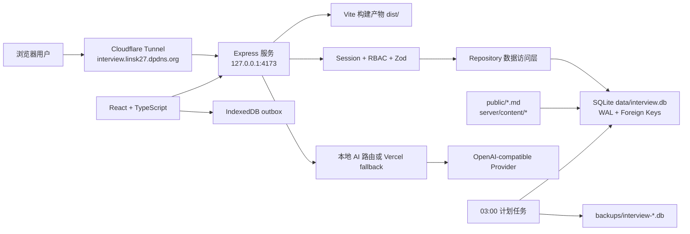
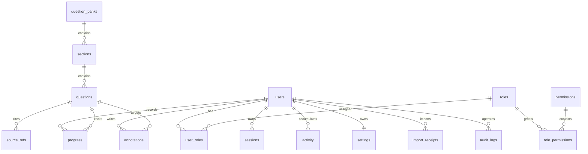

# 面试边注：项目架构、开发与迁移交接文档

> 更新时间：2026-07-18  
> 仓库：`https://github.com/linsk27/interview-margin`  
> 正式入口：`https://interview.linsk27.dpdns.org`  
> 当前定位：个人及小规模用户使用的多用户技术面试学习系统

这份文档用于把项目从当前电脑迁移到个人电脑，并让新的 Codex 任务无需依赖历史聊天就能继续开发。文档只记录架构、约定、变量名和操作步骤，不保存密码、API Key、Cloudflare Tunnel 凭据或个人批注内容。

## 1. Codex 交接记忆

### 1.1 我们正在做什么

把最初的“Markdown 面试题阅读器”改造成一个可长期维护的多用户学习系统：

- 阅读简历技术面试题、JavaScript 选择题及前后端题库。
- 记录阅读进度、掌握状态、收藏、复习日期、阅读位置和文字批注。
- 使用账号跨浏览器同步学习数据。
- 由管理员和编辑维护题库，不再依赖手工修改单个前端文件。
- 使用本机 SQLite 保存运行数据，通过 Cloudflare Tunnel 对外提供服务。
- 通过服务端代理调用 AI，浏览器永远不接触 API Key。

### 1.2 当前目标

当前阶段的主要目标不是继续堆页面，而是完成以下闭环：

1. 把代码、运行数据和部署凭据安全迁移到个人电脑。
2. 保证个人电脑重启后 Express、SQLite 和 Cloudflare Tunnel 能恢复运行。
3. 补齐备份恢复、审计查看、回收站和运行监控。
4. 分批复核新增题目的技术准确性和来源。
5. 保持题库阅读、学习同步和移动端体验稳定。

### 1.3 已完成状态

- 9 个题库、501 道题已写入 SQLite。
- 原有 181 题全部保留，新增 320 题均带来源记录。
- `admin / editor / learner` 三级 RBAC 已实现。
- 登录、改密、停用账号、重置一次性密码和会话撤销已实现。
- 学习进度、批注、设置和活动记录可同步到 SQLite。
- IndexedDB outbox 可在网络失败时暂存最后一次完整学习状态。
- 旧版 `localStorage` 记录支持幂等迁移。
- 题库和题目 CRUD、归档恢复、Markdown 导入预览、JSON/Markdown 导出已实现。
- SQLite 在线备份和每天 03:00 自动备份已实现，保留最近 30 份。
- AI 学习助手通过服务端代理调用 OpenAI-compatible API。
- 题库中心已优化为 1440px 四列、1024px 三列、移动端一列。
- Cloudflare Tunnel 启动脚本已增加单实例监督和重复连接清理。
- 当前回归基线：构建通过、12 个测试文件共 36 项测试通过、501 题数据检查通过。

最近几个关键提交：

- `12a08ea`：多用户 SQLite 学习平台。
- `19c6671`：紧凑题库中心和响应式布局。
- `c1ca76c`：公网服务单实例监督。

## 2. 产品边界

### 2.1 当前适用范围

- 个人长期复习。
- 少量可信用户共同使用。
- 管理员创建账号，不开放自助注册。
- 本机保持开机、联网且不休眠时对外服务。

### 2.2 当前不适用范围

- 大规模公开注册和高并发访问。
- 需要 7x24 小时 SLA 的正式商业服务。
- 多节点部署或多实例并发写 SQLite。
- 把 Git 当作运行数据库或用户数据备份。

如果用户量明显增加，下一步应把 Express 和数据库迁移到云服务器，数据库改为 PostgreSQL 或 MySQL；Cloudflare Tunnel 和本机 SQLite 方案只作为当前阶段的低成本部署。

## 3. 系统架构



### 3.1 前端

技术栈：

- React + TypeScript。
- Vite 构建。
- React Markdown + GFM + Highlight.js 渲染内容。
- Lucide React 图标。
- 原生 IndexedDB 保存待确认写入。
- CSS 变量和响应式布局，没有引入大型组件库。

核心文件：

| 文件 | 职责 |
| --- | --- |
| `src/App.tsx` | 应用总状态、路由视图、登录态、同步和组件编排 |
| `src/components/Reader.tsx` | 单页/双页阅读、分页和正文渲染 |
| `src/components/QuestionBankHub.tsx` | 题库中心、搜索、分类和题库入口 |
| `src/components/AdminPanel.tsx` | 题库、题目、账号和备份管理 |
| `src/components/NotesPanel.tsx` | 本题总结、复习和批注 |
| `src/components/AiAssistant.tsx` | 当前题目 AI 对话 |
| `src/lib/api.ts` | 浏览器 API 客户端 |
| `src/lib/outbox.ts` | IndexedDB 离线写队列 |
| `src/lib/storage.ts` | 旧 localStorage 数据识别与迁移备份 |
| `src/lib/annotationPlugin.ts` | Markdown 文本批注标记 |
| `src/lib/spreadPagination.ts` | 双页分页计算 |
| `src/styles.css` | 全站布局、主题和响应式样式 |

### 3.2 后端

技术栈：

- Node.js + Express。
- `better-sqlite3` 同步数据访问。
- `zod` 请求校验。
- `@node-rs/argon2` 的 Argon2id 密码哈希。
- HttpOnly Cookie 会话。
- Helmet、安全 Origin 检查和登录限流。

分层：

| 文件 | 职责 |
| --- | --- |
| `server/index.js` | 加载环境变量、启动 HTTP 服务和优雅关闭 |
| `server/app.js` | Express 中间件、API 路由、权限和静态文件 |
| `server/auth.js` | 会话创建、Cookie、用户解析和 RBAC 中间件 |
| `server/validation.js` | Zod 输入结构 |
| `server/repository.js` | 数据查询、学习状态合并、CRUD 和审计写入 |
| `server/database.js` | SQLite 初始化、迁移、角色、内置题库种子和管理员初始化 |
| `server/backup-service.js` | SQLite 在线备份及保留策略 |
| `server/content/*` | 内置题库配置、Markdown 解析和题目生成数据 |

### 3.3 学习状态同步

登录用户修改进度或批注后的链路：

1. React 更新内存中的 `StudyState`。
2. 最新完整状态立即写入 IndexedDB `interview-margin-sync/outbox`。
3. 700ms 防抖后调用 `PUT /api/me/state`。
4. 服务端事务写入 `progress / annotations / activity / settings`。
5. 服务端确认后，仅在 revision 仍匹配时清理 IndexedDB。
6. 请求失败时保留最新状态；重新联网或重新登录后调用 `flushQueuedState()` 重试。

当前采用“完整学习状态 upsert”，不是每条进度和批注一个独立接口。这个设计适合当前 501 题和小规模用户，但以后并发用户增多时应改成细粒度 mutation、版本号和冲突合并。

### 3.4 题库数据权威关系

- Git 中的 Markdown 和 `server/content/*` 是内置题库的可重复种子。
- `data/interview.db` 是运行时权威数据源。
- 启动时种子会幂等导入；只自动覆盖 `provenance='seed'` 且内容确实变化的题。
- 管理后台编辑后的题目标记为 `provenance='editor'`，后续种子启动不会强行覆盖。
- 管理后台新增账号、批注、进度和编辑内容不会进入 Git。

因此：只迁移 Git 可以恢复程序和内置 501 题，但不能恢复账号、进度、批注和后台编辑结果。

## 4. 数据模型



主要表：

- 身份权限：`users`、`roles`、`permissions`、`user_roles`、`role_permissions`、`sessions`。
- 内容：`question_banks`、`sections`、`questions`、`source_refs`。
- 学习数据：`progress`、`annotations`、`activity`、`settings`。
- 系统：`schema_migrations`、`app_meta`、`import_receipts`、`audit_logs`。

SQLite 配置：

- `journal_mode = WAL`
- `foreign_keys = ON`
- `busy_timeout = 5000`
- `synchronous = NORMAL`

## 5. 权限模型

| 角色 | 权限 |
| --- | --- |
| `admin` | 全部题库、用户、审计、备份和学习权限 |
| `editor` | 题库读写、归档恢复和自己的学习数据 |
| `learner` | 读取公开题库和维护自己的学习数据 |
| `guest` | 非数据库角色；仅可读取公开题库，不写服务器数据 |

权限最终由 API 检查。前端隐藏按钮只是体验处理，不能替代后端授权。

安全约定：

- 密码使用 Argon2id：64 MiB memory、3 次迭代、并行度 1。
- 会话有效期 30 天；SQLite 只保存随机令牌哈希。
- Cookie 使用 `HttpOnly + Secure + SameSite=Lax`。
- 用户改密、停用或角色变化后撤销现有会话。
- 登录按 IP 和账号限流。
- 写接口校验 Origin 和 Zod 数据结构。
- 管理员接口不提供其他用户私人批注正文的读取能力。

## 6. API 概览

### 公共与认证

- `GET /api/health`
- `GET /api/catalog`
- `GET /api/auth/session`
- `POST /api/auth/login`
- `POST /api/auth/logout`
- `POST /api/auth/change-password`

### 当前用户

- `GET /api/me/state`
- `PUT /api/me/state`
- `POST /api/me/import-local`

### 用户管理

- `GET /api/users`
- `POST /api/users`
- `PATCH /api/users/:id`
- `POST /api/users/:id/reset-password`

### 内容管理

- `GET /api/admin/catalog`
- `POST /api/banks`
- `PATCH /api/banks/:id`
- `DELETE /api/banks/:id`
- `POST /api/banks/:id/restore`
- `POST /api/banks/:bankId/questions`
- `PATCH /api/questions/:id`
- `DELETE /api/questions/:id`
- `POST /api/questions/:id/restore`
- `POST /api/import/markdown/preview`
- `POST /api/banks/:bankId/import-markdown`
- `GET /api/export/catalog.json`
- `GET /api/banks/:id/export.md`

`DELETE` 默认归档；带 `?permanent=true` 才永久删除。永久删除接口已经存在，后台二次确认界面尚未补齐。

### 运维

- `GET /api/audit`
- `GET /api/backups`
- `POST /api/backups`
- `GET /api/backups/:filename`
- `POST /api/ai-chat`

## 7. 本地开发

### 7.1 环境

当前验证环境：

- Windows 11。
- Node.js `v24.18.0`。
- npm `11.16.0`。
- Cloudflared `2026.7.1`。
- Git `2.50.1.windows.1`。

新电脑推荐安装 Node.js 22 LTS 或与当前一致的 Node.js 24。`better-sqlite3` 包含原生模块，如果安装失败，先统一 Node 版本并重新执行 `npm ci`，不要把旧电脑的 `node_modules` 复制过去。

### 7.2 启动

```bash
git clone https://github.com/linsk27/interview-margin.git
cd interview-margin
npm ci
Copy-Item .env.example .env
npm run dev
```

Vite 开发服务会把 `/api` 代理到 `http://127.0.0.1:4173`。需要同时启动后端：

```bash
npm start
```

也可以构建后直接运行本机生产服务：

```bash
npm run start:local
```

### 7.3 必须执行的质量检查

```bash
npm test
npm run db:check
npm run build
```

验收信号：

- 12 个测试文件、36 项测试通过。
- `db:check` 返回 9 个题库、501 题、501 个唯一 ID、320 个新增题均有来源。
- `dist/` 构建成功。
- `http://127.0.0.1:4173/api/health` 返回 `ok: true`。

## 8. 环境变量和密钥

使用 `.env.example` 创建新电脑的 `.env`。不要把 `.env` 提交到 Git。

| 变量 | 作用 |
| --- | --- |
| `HOST` | 本地服务监听地址，Tunnel 模式保持 `127.0.0.1` |
| `PORT` | 默认 `4173` |
| `APP_ORIGINS` | 允许执行写请求的来源列表 |
| `BOOTSTRAP_ADMIN_USERNAME` | 空数据库首次管理员用户名 |
| `BOOTSTRAP_ADMIN_PASSWORD` | 可留空，由系统生成一次性随机密码 |
| `OPENAI_API_KEY` | 服务端 AI 密钥 |
| `OPENAI_BASE_URL` | OpenAI-compatible 上游地址 |
| `OPENAI_MODEL` | 模型名称 |
| `AI_FALLBACK_URL` | 本机未配置密钥时转发到 Vercel AI API |

当前 AI 密钥由 Vercel Environment Variables 管理。本机只需配置 `AI_FALLBACK_URL` 即可使用后备代理。迁移后建议轮换旧密钥，不要从聊天截图、Git 历史或日志中复制密钥。

## 9. Windows 与 Cloudflare 部署

个人电脑正式接管、同一 Tunnel 的防分叉切换、未备案华南 ECS 的使用边界和完整回滚步骤，以
[`PERSONAL_PC_CLOUDFLARE_DEPLOYMENT.md`](PERSONAL_PC_CLOUDFLARE_DEPLOYMENT.md) 为准。

### 9.1 当前结构

- Express 监听 `127.0.0.1:4173`。
- Cloudflare named tunnel：`interview-margin-local`。
- 只为 `interview.linsk27.dpdns.org` 配置路由。
- 根域名 `linsk27.dpdns.org` 是独立博客，迁移时不要修改其 DNS 记录。
- Windows 计划任务：
  - `Interview Margin Public Service`
  - `Interview Margin Database Backup`

### 9.2 机器相关配置

`ops/run-public-service.ps1` 当前包含两个需要在新电脑检查的机器相关值：

```powershell
$cloudflared = 'C:\Program Files (x86)\cloudflared\cloudflared.exe'
$env:HTTP_PROXY = 'http://127.0.0.1:17891'
$env:HTTPS_PROXY = 'http://127.0.0.1:17891'
```

如果新电脑不需要代理，应删除代理环境变量；如果代理端口不同，应改为新电脑实际配置。Cloudflared 路径也必须与新电脑一致。

安装任务：

```powershell
powershell -ExecutionPolicy Bypass -File .\ops\install-scheduled-tasks.ps1
Start-ScheduledTask -TaskName 'Interview Margin Public Service'
```

检查：

```powershell
Get-ScheduledTask -TaskName 'Interview Margin Public Service','Interview Margin Database Backup'
Invoke-RestMethod http://127.0.0.1:4173/api/health
Invoke-RestMethod https://interview.linsk27.dpdns.org/api/health
```

## 10. 从公司电脑迁移到个人电脑

### 10.1 Git 能迁移的内容

- 前后端源代码。
- 501 道内置题的 Markdown 和生成数据。
- 数据库迁移、测试和 Windows 运维脚本。
- 架构和交接文档。

### 10.2 Git 不会迁移的内容

- `data/interview.db`：账号、进度、批注、设置、审计和后台编辑内容。
- `backups/`：SQLite 在线备份。
- `.env`：AI 和服务端配置。
- `%USERPROFILE%\.cloudflared\`：Tunnel 私有凭据和配置。
- `.vercel/`：本地 Vercel 项目绑定。
- `logs/`：运行日志。

这些目录都被 `.gitignore` 排除，禁止为了方便而强行提交。

### 10.3 推荐迁移顺序

#### 第一步：公司电脑创建一致性备份

```powershell
cd D:\个人\learn\interview-reader
npm run db:backup
```

记录 `backups/interview-*.db` 中最新文件。备份文件包含用户账号哈希和私人批注，必须通过加密 U 盘、可信局域网或加密压缩包传输，不能发送到公开聊天或 GitHub。

#### 第二步：个人电脑拉取代码

```powershell
git clone https://github.com/linsk27/interview-margin.git
cd interview-margin
npm ci
npm test
npm run db:check
npm run build
```

#### 第三步：选择数据策略

**保留历史数据：**

1. 确保个人电脑服务尚未运行或已停止。
2. 创建 `data/`。
3. 把最新备份复制为 `data/interview.db`。
4. 不复制 `.db-wal` 或 `.db-shm`；在线备份文件本身已经一致。
5. 启动后登录原管理员账号，并检查进度、批注和后台编辑内容。

**全新开始：**

1. 不复制数据库。
2. 启动服务，系统自动创建 `data/interview.db`。
3. 查看 `data/bootstrap-admin.txt` 中的一次性管理员密码。
4. 首次登录立即改密。

#### 第四步：迁移环境变量

- 以 `.env.example` 为模板在个人电脑重新创建 `.env`。
- 不要直接把旧 `.env` 发到聊天中。
- AI Key 建议在迁移后轮换。
- 核对 `APP_ORIGINS` 仍只允许正式域名和本地开发地址。

#### 第五步：迁移 Cloudflare Tunnel

推荐在个人电脑重新安装 Cloudflared，并安全配置同一个 named tunnel 的凭据。只操作 `interview.linsk27.dpdns.org`，不要重新路由根域名。

需要的本地 Cloudflare 文件通常位于：

```text
%USERPROFILE%\.cloudflared\config.yml
%USERPROFILE%\.cloudflared\<tunnel-id>.json
```

这些文件是私密凭据，不进入 Git。由于两台电脑使用相互独立的 SQLite，正式切换时必须先停止公司电脑上的旧 Connector，再在个人电脑启动新 Connector；不能用双 Connector 换取所谓零停机，否则会造成账号、进度和批注数据分叉。详细顺序见专门部署文档。

#### 第六步：安装计划任务并验收

1. 修改 `ops/run-public-service.ps1` 的 Cloudflared 路径和代理设置。
2. 安装两个计划任务。
3. 检查本地和公网 `/api/health`。
4. 登录账号，修改一题状态并刷新验证同步。
5. 新建一条批注，在另一个浏览器登录验证恢复。
6. 执行一次手动备份并确认生成 `.db` 文件。
7. 重启个人电脑后再次验证服务和 Tunnel。

### 10.4 公司电脑退场清单

只有在个人电脑连续验证通过后执行：

1. 停止并删除公司电脑上的两个 Interview Margin 计划任务。
2. 停止旧 Cloudflare connector。
3. 从公司电脑删除 `.env`、SQLite 数据、备份、日志和 Cloudflare 凭据。
4. 删除 `data/bootstrap-admin.txt`。
5. 在个人电脑修改管理员密码并轮换 AI Key。
6. 在 Cloudflare 和 Vercel 控制台确认没有多余的旧凭据。
7. 最后再删除公司电脑工作目录。

不要在个人电脑验收之前清理公司电脑；至少保留一份离线加密备份。

## 11. 当前缺口与优先级

### P0：迁移和可靠性

- 在个人电脑完成完整迁移与重启验收。
- 增加真正的备份恢复流程和至少一次恢复演练。
- 增加外部可用性监控；本机断网、关机、休眠或代理退出时应通知。
- 确认计划任务在目标使用方式下启动；当前是“用户登录后启动”，不是“未登录即运行”。
- 迁移完成后轮换管理员密码、AI Key 和 Tunnel 凭据。

### P1：管理后台闭环

- 给 `/api/audit` 增加审计日志页面和筛选。
- 增加题库/题目回收站、永久删除二次确认。
- 增加备份恢复入口，恢复前自动再做一次备份。
- 增加题目版本历史和回滚，当前只有乐观锁 `version` 与 `409` 冲突。
- 改进批量排序、批量标签和批量编辑。

### P1：内容质量

- 对新增 320 题按题库分批人工抽查。
- 优先检查版本敏感内容、网络协议、数据库事务、React/Vue 新版本行为。
- 更新事实时保留来源和 `verified_at`，不要无依据改答案。
- 不删除原有 181 题；重复题先建立关联或标记，再决定是否归档。

### P2：扩展性

- 把完整 `StudyState` 保存改成进度和批注的细粒度 API。
- 增加服务端版本或 ETag，完善多设备同时编辑冲突处理。
- 数据量增加后添加 SQLite FTS5 全文索引。
- 长期公开使用时迁移到云服务器和外部数据库。

## 12. 开发约束

继续开发时遵守以下约束：

1. 不删除现有题目来“精简”题库，除非用户明确同意。
2. 保留 `q-*`、`js-q-*` 等旧 ID，显示编号与数据库主键分离。
3. 浏览器不保存 API Key，不把密钥放进 `VITE_*` 环境变量。
4. SQLite 是运行时权威数据源，Markdown 是内置题库种子。
5. 前端是否显示按钮不能替代 API 权限校验。
6. 用户私人批注默认不可被管理员读取。
7. 所有输入继续使用 Zod 校验；所有写接口继续校验 Origin。
8. 内容修改必须考虑 `seed` 与 `editor` provenance，避免启动时覆盖后台编辑。
9. 每次改动至少执行相关测试；共享行为改动执行完整 `npm test`、`db:check` 和 `build`。
10. 部署脚本中不要写入新电脑的密码或 Token。

## 13. 新电脑 Codex 首次接手提示词

可以把下面内容作为新电脑 Codex 的第一条任务：

```text
请接手 interview-margin 项目。先完整阅读：
1. README.md
2. docs/PROJECT_ARCHITECTURE_AND_HANDOFF.md

项目目标：维护一个基于 React + TypeScript + Express + SQLite 的多用户技术面试学习系统。正式域名是 https://interview.linsk27.dpdns.org，本机 Express 通过 Cloudflare Tunnel 提供服务。SQLite 是运行时权威数据源，Git 中的 Markdown 是内置题库种子。

当前优先事项：
1. 在这台个人电脑恢复代码、SQLite 数据、环境变量和 Cloudflare Tunnel。
2. 执行 npm test、npm run db:check、npm run build。
3. 验证本地和公网 /api/health、登录、进度同步、批注、备份和重启恢复。
4. 完成备份恢复、审计日志 UI、回收站和运行监控。

约束：
- 不删除现有 501 题，不修改旧题 ID。
- 不把 .env、data/、backups/、logs/ 或 Cloudflare 凭据提交到 Git。
- 不在浏览器暴露 AI Key。
- 不影响博客根域名 linsk27.dpdns.org，只维护 interview.linsk27.dpdns.org。
- 先检查 git status 和当前运行状态，再修改代码。

请先输出环境与迁移检查结果，然后继续完成当前最高优先级任务，不要重新从零设计项目。
```

## 14. 快速故障定位

### 页面打不开

1. 检查 `http://127.0.0.1:4173/api/health`。
2. 检查 Node `server/index.js` 是否运行。
3. 检查 `Interview Margin Public Service` 是否为 Running。
4. 检查 named tunnel connector 和 `logs/cloudflared.error.log`。
5. 检查代理设置是否仍指向有效端口。

### 能打开但不能保存

1. 检查是否以 learner/editor/admin 登录。
2. 检查是否仍处于首次强制改密状态。
3. 查看 `/api/auth/session`。
4. 检查请求 Origin 是否在 `APP_ORIGINS`。
5. 查看 `logs/server.error.log` 和 SQLite 写锁错误。

### AI 不可用

1. 检查 Vercel 环境变量是否存在。
2. 检查 `AI_FALLBACK_URL`。
3. 检查上游模型名称和余额。
4. 不要把 API Key 放进前端或截图中。

### 题库数量不对

```bash
npm run db:check
```

确认输出应为 9 个题库、501 题。若只迁移了 Git，后台新增或编辑内容不会自动恢复，必须检查迁移的 SQLite 数据库。
