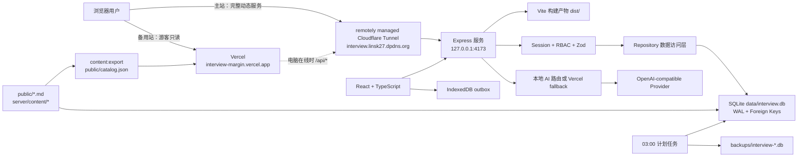
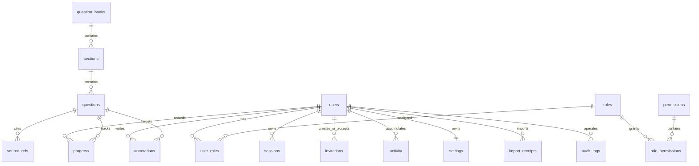

# 面试边注：项目架构、部署与开发交接文档

> 更新时间：2026-08-04
> 仓库：`https://github.com/linsk27/interview-margin`  
> 主站（完整动态服务）：`https://interview.linsk27.dpdns.org`
> 游客备用站（静态题库）：`https://interview-margin.vercel.app`
> 当前定位：个人及小规模用户使用的多用户技术面试学习系统

项目采用双部署：个人电脑是 SQLite、账号和管理功能的唯一动态节点，通过 Cloudflare Tunnel
提供主站；Vercel 独立托管前端和构建时公开题库快照，在个人电脑离线时继续提供游客只读
访问。这份文档用于记录当前架构、运行方式、后续开发约定和未来换机原则，让新的 Codex
任务无需依赖历史聊天就能继续开发。文档只记录变量名和凭据文件位置，不保存密码、API Key、
Cloudflare Tunnel token 或个人批注内容。

## 1. Codex 交接记忆

### 1.1 我们正在做什么

把最初的“Markdown 面试题阅读器”改造成一个可长期维护的多用户学习系统：

- 阅读简历技术面试题、JavaScript 选择题及前后端题库。
- 记录阅读进度、掌握状态、收藏、复习日期、阅读位置和文字批注。
- 使用账号跨浏览器同步学习数据。
- 由管理员和编辑维护题库，不再依赖手工修改单个前端文件。
- 使用本机 SQLite 保存运行数据，通过 Cloudflare Tunnel 对外提供服务。
- 通过服务端代理调用 AI，浏览器永远不接触 API Key。

### 1.2 当前目标

个人电脑部署已经完成，当前阶段的主要目标是继续完善以下闭环：

1. 定期验证个人电脑重启后 Express、SQLite 和 Cloudflare Tunnel 能恢复运行。
2. 补齐备份恢复演练、审计查看、回收站和运行监控。
3. 分批复核新增题目的技术准确性和来源。
4. 保持邀请开通、题库阅读、学习同步和移动端体验稳定。

### 1.3 已完成状态

- 14 个题库、801 道题已写入 SQLite。
- 原有 181 题全部保留，另有 320 道工程题、72 道 360 专项、128 道社区面经题和
  100 道 Java 基础题，结构化题解均带可核验来源。
- `admin / editor / learner` 三级 RBAC 已实现。
- 登录、改密、停用账号、重置一次性密码和会话撤销已实现。
- 管理员一次性邀请注册已实现：默认 72 小时、服务端允许 1–168 小时，受邀者自行设置密码并自动登录为 `learner`。
- 学习进度、批注、设置和活动记录可同步到 SQLite。
- IndexedDB outbox 按 `userId` 分区，可在网络失败时暂存每个账号最后一次完整学习状态；服务端用 `X-Expected-User-Id` 拒绝跨账号竞态写入。
- 旧版 `localStorage` 记录支持幂等迁移。
- 题库和题目 CRUD、归档恢复、Markdown 导入预览、JSON/Markdown 导出已实现。
- SQLite 在线备份和每天 03:00 自动备份已实现，保留最近 30 份。
- AI 学习助手通过服务端代理调用 OpenAI-compatible API。
- 题库中心已优化为 1440px 四列、1024px 三列、移动端一列。
- Cloudflare Tunnel 启动脚本已增加单实例监督和重复连接清理。
- 项目已部署到 Windows 11 个人电脑，运行环境为 Node.js `v22.15.0` 和 cloudflared `2026.7.2`。
- `data/interview.db` 已从 SQLite 一致性备份恢复，不是重新生成的空数据库。
- remotely managed Tunnel `interview-margin-local` 已通过 token file 方式连接；本机不依赖 `config.yml` 或 Tunnel UUID JSON。
- 两个 Windows 计划任务已安装，分别负责公网服务监督和每天 03:00 的数据库备份。
- Vercel 游客备用站独立发布前端和公开题库快照；账户服务失败不会阻塞公开题库渲染。
- `npm run build` 会先导出公开、未归档的内置题为 `public/catalog.json`，供静态部署回退。
- 当前回归基线：构建通过，801 题数据检查通过；40 个测试文件、219/219 项测试通过。

最近几个关键提交：

- `12a08ea`：多用户 SQLite 学习平台。
- `19c6671`：紧凑题库中心和响应式布局。
- `c1ca76c`：公网服务单实例监督。

## 2. 产品边界

### 2.1 当前适用范围

- 个人长期复习。
- 少量可信用户共同使用。
- 管理员直接创建账号，或向可信对象发送一次性 `learner` 邀请。
- 不开放无需邀请的公共自助注册。
- 本机保持开机、联网且不休眠时提供登录、批注、进度同步和后台管理；本机离线时仍可从
  Vercel 备用站只读浏览公开题库快照。

### 2.2 当前不适用范围

- 大规模公开注册和高并发访问。
- 需要 7x24 小时 SLA 的正式商业服务。
- 多节点部署或多实例并发写 SQLite。
- 把 Git 当作运行数据库或用户数据备份。

如果用户量明显增加，下一步应把 Express 和数据库迁移到云服务器，数据库改为 PostgreSQL 或 MySQL；Cloudflare Tunnel 和本机 SQLite 方案只作为当前阶段的低成本部署。

## 3. 系统架构



### 3.1 前端

技术栈：

- React + TypeScript。
- Vite 构建。
- React Markdown + GFM + Highlight.js 渲染内容。
- Lucide React 图标。
- 原生 IndexedDB 保存待确认写入。
- CSS 变量和响应式布局，没有引入大型组件库。

核心文件：

| 文件 | 职责 |
| --- | --- |
| `src/App.tsx` | 应用总状态、路由视图、登录态、同步和组件编排 |
| `src/components/Reader.tsx` | 单页/双页阅读、分页和正文渲染 |
| `src/components/QuestionBankHub.tsx` | 题库中心、搜索、分类和题库入口 |
| `src/components/AdminPanel.tsx` | 题库、题目、账号和备份管理 |
| `src/components/InviteRegistrationDialog.tsx` | 邀请检查、账号注册和注册后登录反馈 |
| `src/components/NotesPanel.tsx` | 本题总结、复习和批注 |
| `src/components/AiAssistant.tsx` | 当前题目 AI 对话 |
| `src/lib/api.ts` | 浏览器 API 客户端 |
| `src/lib/outbox.ts` | IndexedDB 离线写队列 |
| `src/lib/invitations.ts` | fragment 邀请链接生成、读取和地址栏清理 |
| `src/lib/storage.ts` | 旧 localStorage 数据识别与迁移备份 |
| `src/lib/annotationPlugin.ts` | Markdown 文本批注标记 |
| `src/lib/spreadPagination.ts` | 双页分页计算 |
| `src/styles.css` | 全站布局、主题和响应式样式 |
| `vercel.json` | Vercel 构建、SPA 回退、动态 API 代理和缓存策略 |

### 3.2 后端

技术栈：

- Node.js + Express。
- `better-sqlite3` 同步数据访问。
- `zod` 请求校验。
- `@node-rs/argon2` 的 Argon2id 密码哈希。
- HttpOnly Cookie 会话。
- Helmet、安全 Origin 检查和登录限流。

分层：

| 文件 | 职责 |
| --- | --- |
| `server/index.js` | 加载环境变量、启动 HTTP 服务和优雅关闭 |
| `server/app.js` | Express 中间件、API 路由、权限和静态文件 |
| `server/auth.js` | 会话创建、Cookie、用户解析和 RBAC 中间件 |
| `server/validation.js` | Zod 输入结构 |
| `server/invitations.js` | 邀请创建、哈希查找、状态、撤销和原子接受 |
| `server/repository.js` | 数据查询、学习状态合并、CRUD 和审计写入 |
| `server/database.js` | SQLite 初始化、迁移、角色、内置题库种子和管理员初始化 |
| `server/backup-service.js` | SQLite 在线备份及保留策略 |
| `server/content/*` | 内置题库配置、Markdown 解析和题目生成数据 |
| `server/content/export-public-catalog.js` | 从公开、未归档内置题生成确定性的静态题库快照 |

### 3.3 学习状态同步

登录用户修改进度或批注后的链路：

1. React 更新内存中的 `StudyState`，同时捕获当前会话的 `user.id`。
2. 最新完整状态立即写入 IndexedDB `interview-margin-sync/outbox`，键为 `study-state:${userId}`；不同账号互不覆盖。
3. 700ms 防抖后调用 `PUT /api/me/state`，并发送 `X-Expected-User-Id: <userId>`。
4. 服务端事务写入 `progress / annotations / activity / settings`。
5. 服务端确认后，仅在 revision 仍匹配时清理 IndexedDB。
6. 请求失败时保留最新状态；重新联网或重新登录后调用 `flushQueuedState()` 重试。

`GET /api/me/state`、`PUT /api/me/state` 和 `POST /api/me/import-local` 都要求该请求头与
Cookie 当前会话用户完全一致；缺失或不一致时返回 `409 USER_SESSION_CHANGED`。这样即使
用户在防抖、断网重试或旧版数据迁移期间退出并登录了另一个账号，旧异步请求也不能把
数据读写到新账号。IndexedDB 升级到版本 2 时会移除旧的未分区 `study-state` 项。

当前采用“完整学习状态 upsert”，不是每条进度和批注一个独立接口。这个设计适合当前
801 题和小规模用户，但 `X-Expected-User-Id` 只防止跨账号错写，不解决同一账号多设备
同时编辑的最后写入覆盖；以后并发用户增多时应改成细粒度 mutation、版本号和冲突合并。

### 3.4 邀请注册链路

当前账号开通采用“管理员直接创建 + 一次性邀请”的双通道，未提供开放注册入口：

1. 具有 `users.manage` 权限的管理员创建邀请；默认 72 小时，服务端接受 1–168 小时。
2. 服务端生成 32 字节随机 token，只把 SHA-256 哈希写入 SQLite；原始 token 仅随创建响应返回一次。
3. 前端生成 `/#invite/<token>`。fragment 不会发送给 HTTP 服务器，应用读取后立即用 `history.replaceState` 从地址栏和当前历史项清除。
4. 邀请检查和接受都调用固定路径，把 token 放在 JSON 请求体中，避免 token 出现在服务端访问 URL、代理路径或 Referer 中。
5. 未登录的受邀者自行填写用户名、显示名称和 12–256 位密码；用户名为 2–64 位字母、数字、点、下划线或短横线。
6. 服务端在一个 `IMMEDIATE` SQLite 事务中重新检查邀请、创建用户和默认设置、分配 `learner`、标记邀请已使用、创建会话并写入审计；成功响应同时设置会话 Cookie，因此用户自动登录且无需临时密码。

邀请状态由时间戳动态计算，不单独存储：未使用且未撤销、未过期时为 `pending`（界面显示
“可使用”），其余为 `used / revoked / expired`。管理员只能撤销尚未使用的邀请；重复撤销
幂等成功，已使用邀请不能撤销。检查或接受无效、过期、已使用、已撤销的 token 对外统一
返回 `410`，避免暴露具体状态。邀请相关响应使用 `Cache-Control: no-store`，检查按 IP 每
15 分钟最多 20 次，接受按 IP 每小时最多 5 次；所有写请求仍受 Origin 检查。

### 3.5 题库数据权威关系

- Git 中的 Markdown 和 `server/content/*` 是内置题库的可重复种子。
- `data/interview.db` 是运行时权威数据源。
- 启动时种子会幂等导入；只自动覆盖 `provenance='seed'` 且内容确实变化的题。
- 管理后台编辑后的题目标记为 `provenance='editor'`，后续种子启动不会强行覆盖。
- 管理后台新增账号、批注、进度和编辑内容不会进入 Git。

内置富题解的维护链路：

- `server/content/question-data.js` 保存 7 个工程题库的题目清单和短回答。
- `server/content/enrichments/*.js` 按稳定题号保存逐题原理、示例、追问、易错点和来源；
  `npm run content:generate` 生成 `public/question-banks/*.md`，禁止只手改生成产物。
- JavaScript 100 题保留原选择题与答案，由两个 enrichment 文件幂等补齐深度内容。
- `server/content/community-banks/` 保存三套公开社区面经题库以及 Java 基础 100 题的数据；
  社区帖子只证明题目主题确实被报告过，答案由官方规范和项目文档独立校准。面经题每题至少
  包含一个公开面经来源和一个官方来源；Java 基础题只采用 Java 21 API、JLS、JVMS 或
  OpenJDK 官方资料，不伪造社区出处。所有题都过滤自我介绍、薪资、职业规划等非技术内容。
  来源清单由
  `npm run content:generate:community` 写入 `docs/COMMUNITY_INTERVIEW_SOURCE_AUDIT.md`。
- `public/content/diagrams/` 保存受控同源 SVG；Markdown 不允许远程图、Base64、
  空替代文本或原始内联 SVG。
- 720 道结构化富题解都通过正文长度、来源、重复模板和题号/标题一一对应门禁；题目 ID
  集合 SHA-256 固定测试可防止重排导致学习记录错绑。

因此：只迁移 Git 可以恢复程序和内置 801 题，但不能恢复账号、进度、批注和后台编辑结果。

### 3.6 Vercel 静态题库快照

`npm run content:export` 使用内存 SQLite 加载 Git 中的内置种子，只导出公开且未归档的题库，
并按白名单字段写入确定性的 `public/catalog.json`。快照不包含用户、会话、进度、批注、审计
或其他运行数据。`npm run build` 的 `prebuild` 会自动执行该导出，因此 Vercel 每次构建都会
把快照放入 `dist/catalog.json`。

前端优先尝试动态 `/api/catalog`，请求失败、超时或收到无效响应时回退到静态
`/catalog.json`；账户会话请求独立失败，不会阻塞游客题库渲染。静态快照不读取生产
`data/interview.db`，所以仅在后台 SQLite 中新增或修改的 `editor` 内容不会自动出现于备用站。
如需发布这类修改，必须先审阅并同步回受版本控制的题库源，然后重新构建和部署。

## 4. 数据模型



主要表：

- 身份权限：`users`、`roles`、`permissions`、`user_roles`、`role_permissions`、`sessions`、`invitations`。
- 内容：`question_banks`、`sections`、`questions`、`source_refs`。
- 学习数据：`progress`、`annotations`、`activity`、`settings`。
- 系统：`schema_migrations`、`app_meta`、`import_receipts`、`audit_logs`。

邀请表由 migration v3 创建，字段为：

| 字段 | 含义 |
| --- | --- |
| `id` | 邀请 UUID |
| `token_hash` | 原始 token 的 SHA-256 哈希，唯一；数据库不保存原始 token |
| `created_by_user_id` | 创建邀请的管理员用户 ID，删除受限制 |
| `expires_at` / `created_at` | 过期时间和创建时间 |
| `used_at` / `used_by_user_id` | 接受时间及注册出的用户 ID；用户删除时 ID 可置空 |
| `revoked_at` | 管理员撤销时间 |

`pending / used / revoked / expired` 是根据上述时间戳计算的展示状态，不是表字段。数据库
索引覆盖创建时间和过期时间；邀请历史目前与其他运行数据一起进入 SQLite 在线备份。

SQLite 配置：

- `journal_mode = WAL`
- `foreign_keys = ON`
- `busy_timeout = 5000`
- `synchronous = NORMAL`

## 5. 权限模型

| 角色 | 权限 |
| --- | --- |
| `admin` | 全部题库、用户、审计、备份和学习权限 |
| `editor` | 题库读写、归档恢复和自己的学习数据 |
| `learner` | 读取公开题库和维护自己的学习数据 |
| `guest` | 非数据库角色；仅可读取公开题库，不写服务器数据 |

### 5.1 账号开通与维护方式

少量可信用户优先使用邀请：

1. 管理员从正式域名登录后进入“内容管理 → 账号权限 → 邀请注册”。邀请链接按当前页面 origin 生成，不要把 `localhost` 或 `127.0.0.1` 开发页面生成的链接发给其他人。
2. 选择 24 小时、3 天（默认）或 7 天，生成后立即复制完整链接并私下发送。
3. 受邀者退出当前可能登录的账号后打开链接，自行设置用户名、显示名称和密码。
4. 接受成功后用户自动登录，角色固定为 `learner`，学习数据从此按该用户 ID 隔离保存。
5. 管理员可在列表查看可使用、已使用、已撤销和已过期状态，并在邀请使用前撤销。

完整链接只显示一次；刷新管理页后无法找回，应撤销旧邀请并重新生成。邀请已使用后如需
停用该账号，应在“账号权限”的账号列表停用用户，而不是操作邀请。需要 `editor` 或
`admin` 角色时，也应由管理员直接创建账号或在账号列表调整角色。系统没有“无需邀请即可
注册”的按钮或 API。

### 5.2 游客浏览边界

- 游客无需登录即可读取 `visibility=public` 且未归档的题库和完整题目正文。
- 搜索、题库/题目切换、正文滚动、双页翻页、代码复制与临时阅读设置不要求账号。
- 游客的滚动位置、双页位置和阅读设置只作用于当前页面，不读取、不写入个人状态 API。
- 收藏、掌握状态、题目总结、高亮/批注、复习计划、个人概览、个人筛选和记录导入导出
  在操作入口处要求登录，并显示对应原因。
- `/api/me/state` 和 `/api/me/import-local` 始终由服务端鉴权并按当前用户隔离；不得为了
  “游客可读”而放开这些接口。
- 个人电脑、Tunnel 或账户 API 离线时，Vercel 备用站回退到构建时快照；游客仍可阅读、
  搜索和切换题目，但登录、收藏、批注、进度同步、邀请和后台管理不可用。
- `/api/ai-chat` 当前允许游客使用，并有按 IP 的限流；它不保存学习记忆，但会消耗 AI
  服务额度，未来若调整为登录后使用应作为独立的成本控制决策。

权限最终由 API 检查。前端隐藏按钮只是体验处理，不能替代后端授权。

安全约定：

- 密码使用 Argon2id：64 MiB memory、3 次迭代、并行度 1。
- 会话有效期 30 天；SQLite 只保存随机令牌哈希。
- Cookie 使用 `HttpOnly + Secure + SameSite=Lax`。
- 用户改密、停用或角色变化后撤销现有会话。
- 登录按 IP 和账号限流。
- 写接口校验 Origin 和 Zod 数据结构。
- 邀请原始 token 只在创建时返回一次；SQLite、邀请列表和审计元数据不保存 token 明文。
- 已登录用户不能接受邀请，必须先退出，防止无意间切换账号。
- 学习状态 API 要求 `X-Expected-User-Id` 与当前 Cookie 会话一致。
- 管理员接口不提供其他用户私人批注正文的读取能力。

## 6. API 概览

### 公共与认证

- `GET /api/health`
- `GET /api/catalog`
- `GET /api/auth/session`
- `POST /api/auth/login`
- `POST /api/auth/logout`
- `POST /api/auth/change-password`

### 邀请注册

- `POST /api/invitations/inspect`：公开但限流；JSON 为 `{ "token": "..." }`，有效时只返回到期时间。
- `POST /api/invitations/accept`：公开但限流且要求未登录；JSON 包含 `token / username / displayName / password`，成功时创建 `learner` 并设置会话 Cookie。
- `GET /api/admin/invitations`：要求 `users.manage`，列出状态和时间，不返回原始 token。
- `POST /api/admin/invitations`：要求 `users.manage`；JSON 为 `{ "expiresInHours": 72 }`，允许 1–168，原始 token 只在 `201` 响应中出现一次。
- `POST /api/admin/invitations/:id/revoke`：要求 `users.manage`，撤销尚未使用的邀请。

邀请链接使用 `/#invite/<token>` 只是客户端交付格式；不存在按 token 取值的
`GET /api/invitations/:token`。检查与接受均使用固定 URL 和 JSON 请求体，相关响应为
`Cache-Control: no-store`，公开注册保持关闭。

### 当前用户

- `GET /api/me/state`
- `PUT /api/me/state`
- `POST /api/me/import-local`

以上三个接口都要求 `X-Expected-User-Id` 请求头与当前会话用户 ID 一致，否则返回
`409` 和 `USER_SESSION_CHANGED`。

### 用户管理

- `GET /api/users`
- `POST /api/users`
- `PATCH /api/users/:id`
- `POST /api/users/:id/reset-password`

### 内容管理

- `GET /api/admin/catalog`
- `POST /api/banks`
- `PATCH /api/banks/:id`
- `DELETE /api/banks/:id`
- `POST /api/banks/:id/restore`
- `POST /api/banks/:bankId/questions`
- `PATCH /api/questions/:id`
- `DELETE /api/questions/:id`
- `POST /api/questions/:id/restore`
- `POST /api/import/markdown/preview`
- `POST /api/banks/:bankId/import-markdown`
- `GET /api/export/catalog.json`
- `GET /api/banks/:id/export.md`

`DELETE` 默认归档；带 `?permanent=true` 才永久删除。永久删除接口已经存在，后台二次确认界面尚未补齐。

### 运维

- `GET /api/audit`
- `GET /api/backups`
- `POST /api/backups`
- `GET /api/backups/:filename`
- `POST /api/ai-chat`

## 7. 本地开发

### 7.1 环境

当前验证环境：

- Windows 11。
- Node.js `v22.15.0`。
- cloudflared `2026.7.2`。
- Git `2.50.1.windows.1`。

未来换机时推荐使用与当前一致的 Node.js 22。`better-sqlite3` 包含原生模块，如果安装失败，先统一 Node 版本并重新执行 `npm ci`，不要复制其他电脑的 `node_modules`。

### 7.2 启动

```bash
git clone https://github.com/linsk27/interview-margin.git
cd interview-margin
npm ci
Copy-Item .env.example .env
npm run dev
```

Vite 开发服务会把 `/api` 代理到 `http://127.0.0.1:4173`。需要同时启动后端：

```bash
npm start
```

也可以构建后直接运行本机生产服务：

```bash
npm run start:local
```

### 7.3 必须执行的质量检查

生产构建会先通过 `prebuild` 自动生成游客站静态快照；也可单独运行导出并检查数量：

```bash
npm run content:export
```

`public/catalog.json` 是构建产物并被 Git 忽略，不应手工维护或提交。随后执行完整检查：

```bash
npm test
npm run db:check
npm run build
```

验收信号：

- 40 个测试文件、219/219 项测试通过。
- `db:check` 返回 14 个题库、801 题、801 个唯一 ID；720 道结构化题解无缺段、无薄弱
  正文、无旧通用模板，核心题使用受控 SVG 图解。
- `dist/` 构建成功。
- `dist/catalog.json` 存在且只包含公开、未归档题库，不包含账号或个人学习数据。
- `http://127.0.0.1:4173/api/health` 返回 `ok: true`。

## 8. 环境变量和密钥

当前个人电脑的 `.env` 以 `.env.example` 为模板创建。不要把 `.env` 提交到 Git。

| 变量 | 作用 |
| --- | --- |
| `HOST` | 本地服务监听地址，Tunnel 模式保持 `127.0.0.1` |
| `PORT` | 默认 `4173` |
| `APP_ORIGINS` | 允许执行写请求的来源列表 |
| `BOOTSTRAP_ADMIN_USERNAME` | 空数据库首次管理员用户名 |
| `BOOTSTRAP_ADMIN_PASSWORD` | 可留空，由系统生成一次性随机密码 |
| `OPENAI_API_KEY` | 服务端 AI 密钥 |
| `OPENAI_BASE_URL` | OpenAI-compatible 上游地址 |
| `OPENAI_MODEL` | 模型名称 |
| `AI_FALLBACK_URL` | 本机未配置密钥时转发到 Vercel AI API |

`APP_ORIGINS` 当前应同时包含主站 `https://interview.linsk27.dpdns.org`、Vercel 备用站
`https://interview-margin.vercel.app` 和必要的本地开发 origin。这样个人电脑在线时，Vercel
同源 API 代理发起的受保护写请求才能通过服务端 Origin 检查；不要使用通配符。

当前 AI 密钥由 Vercel Environment Variables 管理。本机只需配置 `AI_FALLBACK_URL` 即可使用后备代理。需要轮换密钥时应在对应服务控制台重新生成，不要从聊天截图、Git 历史或日志中复制密钥。

## 9. 双部署：Windows/Cloudflare 与 Vercel

### 9.1 当前结构

- Express 监听 `127.0.0.1:4173`。
- remotely managed Cloudflare Tunnel：`interview-margin-local`。
- 只为 `interview.linsk27.dpdns.org` 配置路由。
- 根域名 `linsk27.dpdns.org` 是独立博客，不要修改其 DNS 记录。
- Windows 计划任务：
  - `Interview Margin Public Service`
  - `Interview Margin Database Backup`

### 9.2 机器相关配置

`ops/run-public-service.ps1` 使用以下机器相关路径和本地服务地址：

```powershell
$cloudflared = 'C:\Program Files (x86)\cloudflared\cloudflared.exe'
$tunnelTokenFile = Join-Path $env:USERPROFILE '.cloudflared\interview-margin-local.token'
$tunnelUrl = 'http://127.0.0.1:4173'
```

当前 Connector 等价于使用以下参数启动：

```powershell
cloudflared tunnel --url http://127.0.0.1:4173 run --token-file "$env:USERPROFILE\.cloudflared\interview-margin-local.token"
```

该 Tunnel 由 Cloudflare 控制台远程管理，本机只保存独立 token 文件；`config.yml` 和按
Tunnel UUID 命名的 JSON 凭据不是当前部署的必需项。token 是秘密，只能保存在用户目录，
不得写入脚本、文档、Git、日志或聊天。本机没有旧公司代理，也不需要为 cloudflared
设置 `HTTP_PROXY` 或 `HTTPS_PROXY`。未来安装路径发生变化时，只需同步更新脚本中的
`$cloudflared`。

安装任务：

```powershell
powershell -ExecutionPolicy Bypass -File .\ops\install-scheduled-tasks.ps1
Start-ScheduledTask -TaskName 'Interview Margin Public Service'
```

检查：

```powershell
Get-ScheduledTask -TaskName 'Interview Margin Public Service','Interview Margin Database Backup'
Invoke-RestMethod http://127.0.0.1:4173/api/health
Invoke-RestMethod https://interview.linsk27.dpdns.org/api/health
```

### 9.3 Vercel 游客备用站

备用入口为 `https://interview-margin.vercel.app`。`vercel.json` 指定 Vite 构建和 `dist/`
输出，并按以下顺序处理路由：

- 仓库中真实存在的静态文件和 `api/ai-chat.js` 由 Vercel 直接提供。
- 其余 `/api/*` 代理到 `https://interview.linsk27.dpdns.org/api/*`；因此登录、进度、批注、
  邀请和后台等动态能力仍要求个人电脑与 Tunnel 在线。
- SPA 路由回退到 `/index.html`。
- `/catalog.json` 是可缓存的公开快照；动态 `/api/*` 明确使用 `private, no-store`。

发布前执行：

```bash
npm test
npm run db:check
npm run build
```

部署后至少检查备用站首页不再跳回主站、`/catalog.json` 能返回 14 个题库/801 题，并模拟
账户 API 不可用验证游客仍能打开正文。不要把生产 SQLite、`.env`、Tunnel token 或
`public/catalog.json` 手工上传；Vercel 应从受版本控制的题库源重新构建快照。

#### 未来把主域名切到 Vercel

当前不能直接把 `interview.linsk27.dpdns.org` 的 DNS 指向 Vercel，因为 Vercel 的
`/api/*` 代理目标也是这个域名，切换后会形成代理回环。若以后希望 Vercel 承接主域名，
必须按以下顺序操作：

1. 新建独立 API 子域名，例如 `api.interview.linsk27.dpdns.org`，并在 Cloudflare Tunnel
   中把它路由到 `http://127.0.0.1:4173`；不要修改博客根域名 `linsk27.dpdns.org`。
2. 把 `vercel.json` 的外部 API 代理目标改为该 API 子域名，并将新前端 origin 加入
   `APP_ORIGINS`。
3. 先用 Vercel 默认域名验证游客回退、登录、Cookie、写请求 Origin、AI 和管理接口。
4. 验证完成后再把 `interview.linsk27.dpdns.org` 绑定到 Vercel；保留 API 子域名只承载
   动态请求。

即使完成该切换，个人电脑离线时也只有静态游客阅读可用；要让账户记忆达到真正的云端
高可用，仍需把 Express 和数据库迁移到云服务器/托管数据库，而不是再复制一份 SQLite。

## 10. 当前个人电脑部署与未来换机原则

### 10.1 当前已完成状态

- 代码和依赖已部署到 Windows 11 个人电脑。
- `data/interview.db` 已由 SQLite 一致性备份恢复，保留原账号、进度、批注、设置、审计和后台编辑内容。
- 本地生产服务监听 `127.0.0.1:4173`，不直接向局域网或公网开放端口。
- remotely managed Tunnel `interview-margin-local` 已连接正式域名，Connector 使用用户目录中的 `interview-margin-local.token`。
- `Interview Margin Public Service` 和 `Interview Margin Database Backup` 两个计划任务已安装。
- 当前 cloudflared 直连 Cloudflare，不使用旧公司代理或其他本地 HTTP(S) 代理。
- Vercel 备用站使用同一仓库构建出的前端和公开题库快照，不保存或复制生产 SQLite。

### 10.2 Git 与本地私有状态的边界

Git 能保存前后端源代码、501 道内置题的 Markdown 和生成数据、数据库迁移、测试、
Windows 运维脚本及本文档。以下运行状态不会由 Git 恢复：

- `data/interview.db`：账号、进度、批注、设置、审计和后台编辑内容。
- `backups/`：SQLite 在线备份。
- `.env`：AI 和服务端配置。
- `%USERPROFILE%\.cloudflared\interview-margin-local.token`：Tunnel token。
- `.vercel/`：本地 Vercel 项目绑定。
- `public/catalog.json`：构建时生成的公开题库快照，可由 `npm run content:export` 重建。
- `logs/`：运行日志。

这些文件或目录被 `.gitignore` 排除时，不得为了方便而强行提交。备份数据库含有账号哈希
和私人批注，传输时应使用加密 U 盘、可信局域网或加密压缩包，不能上传到公开聊天或
GitHub。

### 10.3 未来换机的安全顺序

1. 在仍在运行的来源电脑上执行 `npm run db:backup`，取得 SQLite 在线一致性备份。
2. 在目标电脑拉取代码，执行 `npm ci`、`npm test`、`npm run db:check` 和 `npm run build`；不要复制旧 `node_modules`。
3. 确保目标 Express 服务已停止，再把一致性备份复制为 `data/interview.db`。不要复制 `.db-wal` 或 `.db-shm`。
4. 以 `.env.example` 为模板在目标电脑重新创建 `.env`，核对 `APP_ORIGINS`；秘密不得经过 Git、日志或聊天传输。
5. 在 Cloudflare 控制台为 remotely managed Tunnel 取得或重新签发 connector token，只把 token 保存到目标用户目录的 `.cloudflared/interview-margin-local.token`。
6. 安装两个计划任务，检查本地和公网 `/api/health`，再验证登录、进度同步、批注和手动备份。
7. 完成一次目标电脑重启验收后，停止旧 Connector，并在 Cloudflare 控制台撤销不再使用的旧 token。
8. 至少保留一份离线加密数据库备份，再清理旧电脑的 `.env`、数据库、备份、日志和 token。

当前 remotely managed 方案不需要迁移 `config.yml` 或 Tunnel UUID JSON。未来即使改变
Tunnel 管理方式，也必须遵守三个原则：运行数据库来自一致性备份；SQLite 只有一个权威
写入节点；新节点完成验收之前不销毁旧数据或离线备份。迁移期间不要让两台电脑各自写入
独立 SQLite，否则账号、进度和批注会分叉。

## 11. 当前缺口与优先级

### P0：运行可靠性

- 记录一次个人电脑完整重启验收，确认登录后两个计划任务和公网入口恢复。
- 增加真正的备份恢复流程，并至少执行一次恢复演练。
- 增加外部可用性监控，并分别监控主站动态 API 与 Vercel 静态快照；本机断网、关机、
  休眠或 Tunnel 退出时应通知，但不应误报为游客备用站整体不可读。
- 确认计划任务在目标使用方式下启动；当前是“用户登录后启动”，不是“未登录即运行”。
- 制定管理员密码、AI Key 和 Tunnel token 的轮换与撤销流程。

### P1：管理后台闭环

- 给 `/api/audit` 增加审计日志页面和筛选。
- 邀请目前由管理员手动复制和私下发送，没有邮件投递、到期提醒、批量邀请或密码找回流程。
- 邀请列表当前读取全部历史记录，没有分页、归档和历史清理策略；公开注册仍应保持关闭。
- 增加题库/题目回收站、永久删除二次确认。
- 增加备份恢复入口，恢复前自动再做一次备份。
- 增加题目版本历史和回滚，当前只有乐观锁 `version` 与 `409` 冲突。
- 改进批量排序、批量标签和批量编辑。

### P1：内容质量

- 720 道结构化题已完成逐题 enrichment，后续仍应按月抽查版本敏感内容、网络协议、数据库
  事务以及 React/Vue/构建工具的新版本行为。
- 继续为适合用流程表达的核心题补图，但应优先复用当前 SVG 设计语言，避免装饰性图片。
- 更新事实时保留来源和 `verified_at`，不要无依据改答案。
- 不删除原有 181 题；重复题先建立关联或标记，再决定是否归档。

### P2：扩展性

- 把完整 `StudyState` 保存改成进度和批注的细粒度 API。
- 增加服务端版本或 ETag，完善同一账号多设备同时编辑冲突处理；当前 `X-Expected-User-Id` 只防跨账号错写。
- 数据量增加后添加 SQLite FTS5 全文索引。
- 长期公开使用时迁移到云服务器和外部数据库。

## 12. 开发约束

继续开发时遵守以下约束：

1. 不删除现有题目来“精简”题库，除非用户明确同意。
2. 保留 `q-*`、`js-q-*` 等旧 ID，显示编号与数据库主键分离。
3. 浏览器不保存 API Key，不把密钥放进 `VITE_*` 环境变量。
4. SQLite 是运行时权威数据源，Markdown 是内置题库种子。
5. 前端是否显示按钮不能替代 API 权限校验。
6. 用户私人批注默认不可被管理员读取。
7. 所有输入继续使用 Zod 校验；所有写接口继续校验 Origin。
8. 内容修改必须考虑 `seed` 与 `editor` provenance，避免启动时覆盖后台编辑。
9. 每次改动至少执行相关测试；共享行为改动执行完整 `npm test`、`db:check` 和 `build`。
10. 部署脚本中不要写入密码或 token。
11. 邀请 token 继续采用 fragment 交付、JSON body 传输和仅存哈希；不得改成路径参数、查询参数、日志字段或数据库明文。
12. 学习状态 outbox 必须继续按 `userId` 分区，相关 API 不得绕过 `X-Expected-User-Id` 校验。

## 13. Codex 后续接手提示词

可以把下面内容作为新的 Codex 任务的第一条消息：

```text
请接手 interview-margin 项目。先完整阅读：
1. README.md
2. docs/PROJECT_ARCHITECTURE_AND_HANDOFF.md

项目目标：维护一个基于 React + TypeScript + Express + SQLite 的多用户技术面试学习系统。主站 https://interview.linsk27.dpdns.org 由本机 Express 通过 Cloudflare Tunnel 提供完整动态服务；Vercel 备用站 https://interview-margin.vercel.app 独立提供前端和构建时公开题库快照。SQLite 是运行时权威数据源，Git 中的 Markdown 是内置题库种子。

账号开通：管理员可生成默认 72 小时、最多 168 小时的一次性 learner 邀请，公开注册关闭。邀请 token 使用 URL fragment 交付、固定 API 的 JSON body 传输，数据库只存哈希；学习 outbox 按 userId 分区并由 X-Expected-User-Id 防止跨账号竞态。

当前部署：Windows 11、Node.js v22.15.0、cloudflared 2026.7.2；SQLite 已从一致性备份恢复。remotely managed Tunnel interview-margin-local 通过用户目录中的 token file 连接，不使用 config.yml、Tunnel UUID JSON 或旧公司代理。两个 Windows 计划任务已安装。npm run build 会先运行 content:export；账户 API 离线时 Vercel 必须回退到 catalog.json，游客仍可读，账号记忆功能不可用。

当前优先事项：
1. 先检查当前进程、两个计划任务、本地与公网 /api/health，不要重建或覆盖现有 SQLite。
2. 执行 npm test、npm run db:check、npm run build。
3. 验证登录、进度同步、批注、手动备份和重启恢复。
4. 完成备份恢复演练、审计日志 UI、回收站和运行监控。

约束：
- 不删除现有 801 题，不修改旧题 ID。
- 不把 .env、data/、backups/、logs/ 或 Cloudflare 凭据提交到 Git。
- 不在浏览器暴露 AI Key。
- 不影响博客根域名 linsk27.dpdns.org，只维护 interview.linsk27.dpdns.org。
- 先检查 git status 和当前运行状态，再修改代码。

请先输出环境与运行状态检查结果，然后继续完成当前最高优先级任务，不要重新从零设计项目。
```

## 14. 快速故障定位

### 主站页面打不开

1. 检查 `http://127.0.0.1:4173/api/health`。
2. 检查 Node `server/index.js` 是否运行。
3. 检查 `Interview Margin Public Service` 是否为 Running。
4. 检查 remotely managed Tunnel Connector 和 `logs/cloudflared.error.log`。
5. 检查 `~/.cloudflared/interview-margin-local.token` 是否存在，以及启动参数是否仍指向 `127.0.0.1:4173`。

主站故障时先使用 `https://interview-margin.vercel.app` 验证游客备用阅读；不要因为动态 API
离线就重新生成或覆盖 SQLite。

### Vercel 备用站没有题库

1. 直接检查 `https://interview-margin.vercel.app/catalog.json` 是否返回 JSON，而不是 SPA HTML。
2. 本地运行 `npm run content:export` 和 `npm run build`，确认 `dist/catalog.json` 存在。
3. 检查 Vercel 部署是否包含最新构建，以及 `vercel.json` 的 SPA 回退没有遮蔽真实静态文件。
4. 若只有 `/api/catalog` 失败而 `/catalog.json` 正常，应保持游客回退，不要把账户 API 故障当成题库为空。

### 能打开但不能保存

个人电脑或 Tunnel 离线时，Vercel 备用站只能游客只读，这是预期降级。若个人电脑在线仍不能保存：

1. 检查是否以 learner/editor/admin 登录。
2. 检查是否仍处于首次强制改密状态。
3. 查看 `/api/auth/session`。
4. 检查请求 Origin 是否在 `APP_ORIGINS`。
5. 查看 `logs/server.error.log` 和 SQLite 写锁错误。

### 邀请打不开或无法注册

1. 确认链接来自正式域名后台，而不是 `localhost` 或 `127.0.0.1` 开发页面。
2. 邀请 fragment 会在页面读取后立即从地址栏消失，这是预期的安全行为；不要据此判断链接损坏。
3. 确认浏览器没有登录其他账号；已登录状态不能接受邀请。
4. 在管理员“账号权限”中检查邀请是可使用、已使用、已撤销还是已过期；完整链接无法从列表恢复。
5. 已失效链接应撤销（如仍可撤销）并重新生成，不要尝试从数据库哈希还原 token。

### AI 不可用

1. 检查 Vercel 环境变量是否存在。
2. 检查 `AI_FALLBACK_URL`。
3. 检查上游模型名称和余额。
4. 不要把 API Key 放进前端或截图中。

### 题库数量不对

```bash
npm run db:check
```

确认输出应为 14 个题库、801 题。主站动态目录不对时检查生产 SQLite；Vercel 静态目录不对时
运行 `npm run content:export` 并重新部署。仅存在于生产 SQLite 的后台新增/编辑内容不会自动
进入静态快照。
